# GLO-3101_final

- [GLO-3101_final](#glo-3101_final)
  - [Quelles sont les 4 étapes importantes de la planification d'un projet](#quelles-sont-les-4-étapes-importantes-de-la-planification-dun-projet)
  - [Éléments de l'ordonnancement (6)](#éléments-de-lordonnancement-6)
  - [Activité / Tâches  de l'ordonnancement (#important)](#activité--tâches--de-lordonnancement-important)
  - [Critique de l'ordonnancement (#important)](#critique-de-lordonnancement-important)
  - [Chemin critique de l'ordonnancement (#important)](#chemin-critique-de-lordonnancement-important)
  - [Événement de l'ordonnancement est (#important)](#événement-de-lordonnancement-est-important)
  - [Que représentent la durée et les efforts de l'ordonnancement (#important)](#que-représentent-la-durée-et-les-efforts-de-lordonnancement-important)
  - [Jalon ("milestone") de l'ordonnancement (#important)](#jalon-milestone-de-lordonnancement-important)
  - [Quels sont les 3(+3) objectifs de l'ordonancement](#quels-sont-les-33-objectifs-de-lordonancement)
  - [Quand réaliser l'ordonnancement](#quand-réaliser-lordonnancement)
  - [Qu'est ce que l'ordonnancement](#quest-ce-que-lordonnancement)
  - [Qu'est ce qui suit souvent l'ordonnancement](#quest-ce-qui-suit-souvent-lordonnancement)
  - [Types de dépendances sur les tâches (4)](#types-de-dépendances-sur-les-tâches-4)
  - [Types de dépendance du GANTT (4)](#types-de-dépendance-du-gantt-4)
  - [Estimation de l'effort (2)](#estimation-de-leffort-2)
  - [PERT stands for](#pert-stands-for)
  - [PERT's formulas](#perts-formulas)
  - [Avantange du GANTT (1)](#avantange-du-gantt-1)
  - [Désavantage du Gantt (2)](#désavantage-du-gantt-2)
  - [Best practice construction jalons (4)](#best-practice-construction-jalons-4)
  - [Qu'est ce que CPM (#important)](#quest-ce-que-cpm-important)
  - [A critical path for a project is (#important)](#a-critical-path-for-a-project-is-important)
  - [Slack or float is the (#important)](#slack-or-float-is-the-important)
  - [Qu'est ce qu'un bufffer ? (#important)](#quest-ce-quun-bufffer--important)
  - [Quels sont les objectifs du nivellement/lissage des ressources ?(2)](#quels-sont-les-objectifs-du-nivellementlissage-des-ressources-2)
  - [Pour effectuer ce nivellement, on peut jouer sur : (3)](#pour-effectuer-ce-nivellement-on-peut-jouer-sur--3)
  - [2 technique de gestion de projet (#important)](#2-technique-de-gestion-de-projet-important)
  - [Qu'implique le « Fast-Tracking » d’un projet ? (#important)](#quimplique-le--fast-tracking--dun-projet--important)
  - [« Fast-Tracking » est surtout utilisée lorsque (2) (#important)](#-fast-tracking--est-surtout-utilisée-lorsque-2-important)
  - [« Crashing » d’un projet implique essentiellement (#important)](#-crashing--dun-projet-implique-essentiellement-important)
  - [« Crashing » est surtout utilisée (2):](#-crashing--est-surtout-utilisée-2)
  - [Pourquoi la gestion de risques ?](#pourquoi-la-gestion-de-risques-)
  - [Définitions du risque du dictionnaire (#important)](#définitions-du-risque-du-dictionnaire-important)
  - [Définitions du risque selon SEI (Software Engineering Institute)(#important)](#définitions-du-risque-selon-sei-software-engineering-instituteimportant)
  - [Risque vs facteur de risque (#important)](#risque-vs-facteur-de-risque-important)
  - [Risque à impact positif](#risque-à-impact-positif)
  - [Composante d'un risque (3)](#composante-dun-risque-3)
  - [Le chargé de projet ne peut souvent intervenir que sur ces deux aspects du risque :](#le-chargé-de-projet-ne-peut-souvent-intervenir-que-sur-ces-deux-aspects-du-risque-)
  - [Formule de l'exposition :](#formule-de-lexposition-)
  - [Type d'incertitude (#important)](#type-dincertitude-important)
  - [Connu/Connu (#important)](#connuconnu-important)
  - [Connu/Inconnu (#important)](#connuinconnu-important)
  - [Inconnu/Inconnu (#important)](#inconnuinconnu-important)
  - [Processus de gestion du risque (6) (#important)](#processus-de-gestion-du-risque-6-important)
  - [Planification de la gestion des risques (5) (#important)](#planification-de-la-gestion-des-risques-5-important)
  - [Catégorie de risques (3/10) (#important)](#catégorie-de-risques-310-important)
  - [Identification des risques (5) (#important)](#identification-des-risques-5-important)
  - [Analyse des risques (5) (#important)](#analyse-des-risques-5-important)
  - [Matrice d'évaluation des risques (#important)](#matrice-dévaluation-des-risques-important)
  - [Planification de la réponse aux risques (7) (#important)](#planification-de-la-réponse-aux-risques-7-important)
  - [Stratégie de réponse : réduction du risque (2) (#important)](#stratégie-de-réponse--réduction-du-risque-2-important)
  - [Stratégies de réponse : élimination du risque (2) (#important)](#stratégies-de-réponse--élimination-du-risque-2-important)
  - [Stratégies de réponse : transfert du risque (3) (#important)](#stratégies-de-réponse--transfert-du-risque-3-important)
  - [Stratégies de réponse : partage du risque (2) (#important)](#stratégies-de-réponse--partage-du-risque-2-important)
  - [Stratégies de réponse : acceptation du risque (#important)](#stratégies-de-réponse--acceptation-du-risque-important)
  - [Surveillances des risques (5) (#important)](#surveillances-des-risques-5-important)
  - [Techniques de quantification du risque (5)](#techniques-de-quantification-du-risque-5)
  - [Participant à la gestion du risque (6)](#participant-à-la-gestion-du-risque-6)
  - [Un système de base en gestion du risque (5)](#un-système-de-base-en-gestion-du-risque-5)
  - [Les 9 risques les plus importants en TI (3/9)](#les-9-risques-les-plus-importants-en-ti-39)
  - [Qu'est ce qui est nécessaire pour la gestion de risque](#quest-ce-qui-est-nécessaire-pour-la-gestion-de-risque)
  - [Impacts sur un projet que peut avoir un changement (3/8)](#impacts-sur-un-projet-que-peut-avoir-un-changement-38)
  - [Le processus de gestion des DDC(demande de changement) couvre (5)](#le-processus-de-gestion-des-ddcdemande-de-changement-couvre-5)
  - [A quoi sert le suivi et contrôle de projet ?](#a-quoi-sert-le-suivi-et-contrôle-de-projet-)
  - [Le suivi comprends (4)](#le-suivi-comprends-4)
  - [Le suivi et contrôle de projet consiste à (7)](#le-suivi-et-contrôle-de-projet-consiste-à-7)
  - [Activité du contrôle d'avancement (4) (less_imp)](#activité-du-contrôle-davancement-4-less_imp)
  - [Le Contrôle, c'est le pouvoir, autorité, hiérarchie ?](#le-contrôle-cest-le-pouvoir-autorité-hiérarchie-)
  - [Principe du contrôle (3)](#principe-du-contrôle-3)
  - [Objectifs - Revue de progrès (4)](#objectifs---revue-de-progrès-4)
  - [Valeur acquise (Earned Value Management/Analyse de Variance) est](#valeur-acquise-earned-value-managementanalyse-de-variance-est)
  - [Quelles sont les valeurs utilsées dans l'analyse des variances](#quelles-sont-les-valeurs-utilsées-dans-lanalyse-des-variances)
  - [Qu'est ce que la Valeur planifiée (VP)?](#quest-ce-que-la-valeur-planifiée-vp)
  - [Qu'est ce que la Valeur acquise (VA)?](#quest-ce-que-la-valeur-acquise-va)
  - [Qu'est ce que le coût réel (CR)?](#quest-ce-que-le-coût-réel-cr)
  - [Qu'est ce que l'écart de coût (EC)?](#quest-ce-que-lécart-de-coût-ec)
  - [Qu'est ce que l'écart de délais (ED)?](#quest-ce-que-lécart-de-délais-ed)
  - [Qu'est ce que l'IPC ?](#quest-ce-que-lipc-)
  - [Qu'est ce que l'IPE ?](#quest-ce-que-lipe-)
  - [Pourquoi les besoin sont-ils si importants ?](#pourquoi-les-besoin-sont-ils-si-importants-)
  - [Types de besoin fonctionnel (2)](#types-de-besoin-fonctionnel-2)
  - [(2) types de besoin Non fonctionnel](#2-types-de-besoin-non-fonctionnel)
  - [Le besoin doivent être (2)](#le-besoin-doivent-être-2)
  - [Techniques d’explicitation des exigences (6)(#important)](#techniques-dexplicitation-des-exigences-6important)
  - [Choix de la technique d’explicitation (7)](#choix-de-la-technique-dexplicitation-7)
  - [Conseils pour réussir une interview (6)](#conseils-pour-réussir-une-interview-6)
  - [Le questionnaire est limité, car (4)](#le-questionnaire-est-limité-car-4)
  - [Le questionnaire est utile pour](#le-questionnaire-est-utile-pour)
  - [Pourquoi faire un atelier d’explicitation des exigences ? (5)](#pourquoi-faire-un-atelier-dexplicitation-des-exigences--5)
  - [Remue-méninges (5)](#remue-méninges-5)
  - [Règles pour le remue-méninges (4)](#règles-pour-le-remue-méninges-4)
  - [Étapes du remue-méninges (5)](#étapes-du-remue-méninges-5)
  - [A quoi sert le Scénario-maquette ?](#a-quoi-sert-le-scénario-maquette-)
  - [Jeux de rôles](#jeux-de-rôles)
  - [A quoi sert le prototypage ?](#a-quoi-sert-le-prototypage-)
  - [Que faut-il prototyper ? (#important)](#que-faut-il-prototyper--important)
  - [Les dangers de prototypage (3)](#les-dangers-de-prototypage-3)
  - [L'emphase du chargé de projet au quotidien devrait-elle être centrée sur : (3/10)](#lemphase-du-chargé-de-projet-au-quotidien-devrait-elle-être-centrée-sur--310)
  - [Rôle au quotidien (3/11)](#rôle-au-quotidien-311)
  - [Choisir un chargé de projet](#choisir-un-chargé-de-projet)
  - [Project Human Resource Management](#project-human-resource-management)
  - [Important areas related to project management include: (#important)](#important-areas-related-to-project-management-include-important)
  - [Type de motivation (#important)](#type-de-motivation-important)
  - [Maslow's Heriarchy of needs](#maslows-heriarchy-of-needs)
  - [Frederick Herzberg's motivational and hygiene factor (#important)](#frederick-herzbergs-motivational-and-hygiene-factor-important)
  - [McClelland's acquired-needs theory (#important)](#mcclellands-acquired-needs-theory-important)
  - [Thamhain and Wilemon's ways to have influence on projects](#thamhain-and-wilemons-ways-to-have-influence-on-projects)
  - [Projects are more likely to succeed when project managers influence with:](#projects-are-more-likely-to-succeed-when-project-managers-influence-with)
  - [Projects are more likely to fail whenproject managers rely too heavily on:](#projects-are-more-likely-to-fail-whenproject-managers-rely-too-heavily-on)
  - [Power is the (#important)](#power-is-the-important)
  - [Types of power include (5) (#important)](#types-of-power-include-5-important)
  - [Project managers can apply Covey’s 7 habits to improve effectiveness on projects (#important)](#project-managers-can-apply-coveys-7-habits-to-improve-effectiveness-on-projects-important)
  - [Tuckman Model of Team Development (5)](#tuckman-model-of-team-development-5)
  - [Social styles profile](#social-styles-profile)
  - [The five dysfunctions of teams are:](#the-five-dysfunctions-of-teams-are)
  - [General advice on Teams (4)](#general-advice-on-teams-4)
  - [Project managers must (3)](#project-managers-must-3)
  - [La gestion des communications du projet est le](#la-gestion-des-communications-du-projet-est-le)
  - [Le processus Établissement du rapport d'avancement implique](#le-processus-établissement-du-rapport-davancement-implique)
  - [La gestion des parties prenantes fait référence au](#la-gestion-des-parties-prenantes-fait-référence-au)
  - [Un système de base pour gérer les communications comprend au moins :](#un-système-de-base-pour-gérer-les-communications-comprend-au-moins-)
  - [Les rencontres de statut (#important)](#les-rencontres-de-statut-important)
  - [Objectifs des rencontres de (5)](#objectifs-des-rencontres-de-5)
  - [Une rencontre, c’est une opportunité de (3)](#une-rencontre-cest-une-opportunité-de-3)
  - [3 types de rencontres de projet (#may_important)](#3-types-de-rencontres-de-projet-may_important)
  - [Le «daily Team Stand-up»  (#may_important)](#le-daily-team-stand-up--may_important)
  - [La rencontre de statut de l’équipe (#important)](#la-rencontre-de-statut-de-léquipe-important)
  - [La revue de projet externe (#may_important)](#la-revue-de-projet-externe-may_important)
  - [Communication flash (#may_important)s](#communication-flash-may_importants)
  - [La fermeture de projet comprend](#la-fermeture-de-projet-comprend)
  - [Fermeture administrative du projet détaille](#fermeture-administrative-du-projet-détaille)
  - [Fermeture de contrat](#fermeture-de-contrat)
  - [Comment faire le redressement d’un projet en déroute...???](#comment-faire-le-redressement-dun-projet-en-déroute)
  - [Étapes redressement de projet](#étapes-redressement-de-projet)
  - [Exam](#exam)

> S10
> Ordonnancement et Itérations

Objectif :
  - Comprendre l’importance des calendriers et échéanciers
  - Connaître la terminologie spécifique aux échéanciers
  - Connaître les diagramme de réseau et son utilisation
  - Connaître les techniques de nivellement des ressources
  - Clarifier les concepts durée vs effort
  - Utiliser un diagramme de Gantt pour planifier et suivre l’avancement d’un projet
  - Calculer le chemin critique d’un projet
  - Connaître comment la chaîne critique et la technique - - PERT impact le développement de l’échéancier
  - Connaître les concepts d’agilité en terme de -    planification (Itérations et re-planification)

## Quelles sont les 4 étapes importantes de la planification d'un projet
1. Identifier ce qui doit être fait (Planifier)
2. Identifier les efforts & coûts (Estimation)
3. Identifier les dépendances (Ordonnancement)
4. Assigner les ressources (Capacité)

## Éléments de l'ordonnancement (6)
- Activité / Tâches
- Critique
- Chemin critique
- Événement
- Durée et efforts
- Jalon ("milestone")

## Activité / Tâches  de l'ordonnancement (#important)
- Action qui consomme du temps et possiblement d’autres ressources

## Critique de l'ordonnancement (#important)
- Activité ou événement qui doit être complété à un certain moment sans bénéficier d’aucune latitude dans le temps (flottement)

## Chemin critique de l'ordonnancement (#important)
- Chemin le plus long dans le réseau; détermine la date la plus hâtive à laquelle le projet peut être complété

## Événement de l'ordonnancement est (#important)
- Début ou fin d’une activité (moment spécifique dans le temps)

## Que représentent la durée et les efforts de l'ordonnancement (#important)
- La **durée** représente le temps calendrier que prendra une tâche.
- Les **efforts** représentent le nombre de Jours / Personnes qui seront requis pour effectuer cette tâche

$$ Durée=Efforts / unités $$

Par exemple, un effort de 8 J/P est requis pour recueillir les besoins dans un projet. Les efforts représentent le nombre de J/P requis pour l’Analyste pour effectuer cette tâche, peut importe si cela doit se faire sur une période CALENDRIER de 30 Jours.

## Jalon ("milestone") de l'ordonnancement (#important)
- Événement qui représente un point dans le projet avec une signification particulière, généralement la fin d’une phase ou étape d’une projet
- Possède normalement une Durée de Zéro (0)
- Permet d’identifier des points critiques dans votre projet
- Représenté par un diamant ou un triangle inversé dans votre plan de projet Ms Project...
- Utilisé pour des points de revus ou décision de votre projet
- Élément de motivation
- Début ou fin de phase
  - Ex: Revue de besoins, fin du développement, etc...
  - Ex: Acception des essais du client...

## Quels sont les 3(+3) objectifs de l'ordonancement
- Identifier la **durée** du projet optimale...
- Au plus **bas coût**
- Et avec le **moins de risques**
- (mais aussi, moins important)
- Déterminer les choix possibles
- Utilisation plus efficaces des ressources
- Outils de communication

## Quand réaliser l'ordonnancement
une fois que le WBS a été produit ET que les
efforts ont été estimés.

## Qu'est ce que l'ordonnancement
Activité qui vise à plannifier l'utilisation des ressources et d'en déduire les implications (en termes d’intégration, d’approvisionnement, de communication et de synergie entre les individus, équipes, processus)

## Qu'est ce qui suit souvent l'ordonnancement
Le nivellement des ressources qui permet, en fonction des niveaux de flottements identifiés, de minimiser les fluctuations au niveau des ressources (humaines, matérielles, ...)

## Types de dépendances sur les tâches (4)
**Obligatoires** : gros bon sens...la fondation avant les murs...
  - Ex: Le Code avant les essais

**Discrétionnaire** : souvent déterminé par l’équipe du projet ou le Chargé de projet
  - Ex: Ordre de développement de certaines fonctions ou modules...

**Externes** : provient d’un élément externe au projet
  - Ex: Signature d’un contrat, obtention d’un logiciel 3rd party, Besoin d’une nouvelle version d’un logiciel de Microsoft..

**Ressources** : 2 Tâches dépendent de la même ressource
  - Ex: Un seul DBA pour plusieurs tâches...

## Types de dépendance du GANTT (4)
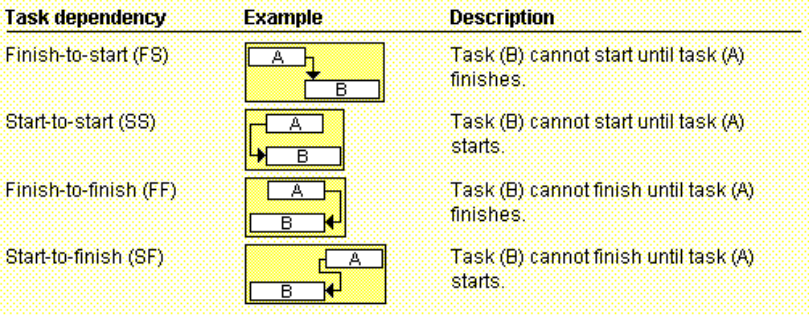

## Estimation de l'effort (2)
- Normalement, les estimés sont donnés avec un chiffre précis : 3 Jours, 30 000$, etc.
- 3 scénarios ou possibilités : optimiste, réaliste, pessimiste : 3 Jours, 5 Jours, 7 Jours,...

## PERT stands for
Program Evaluation & Review Techniques

## PERT's formulas
$$ PERT~weighted~average = \frac{optimistic~time~+~4X~most~likely time~+~pessimistic~time}{6} $$

## Avantange du GANTT (1)
Facile à comprendre, créer, maintenir...

## Désavantage du Gantt (2)
- Parfois difficile de voir les dépendances...(Ce n’est plus vrai maintenant avec l’aide des logiciels comme Ms-Project)
- Ne permet pas facilement de tenir compte des incertitudes reliées à certaines tâches (vs PERT)

## Best practice construction jalons (4)
- Définir des jalons tôt dans le projet
- Garder les jalons courts et fréquents
- Chaque jalon doit être binaire (pas charte de projet fait à 33%)
- Suivre de manière assidu le chemin critique

## Qu'est ce que CPM (#important)
network diagramming technique used to predict total project duration

## A critical path for a project is (#important)
the series of activities that determines the earliest time by which the project can be completed

OR

The critical path is the longest path through the network
diagram and has the least amount of slack or float

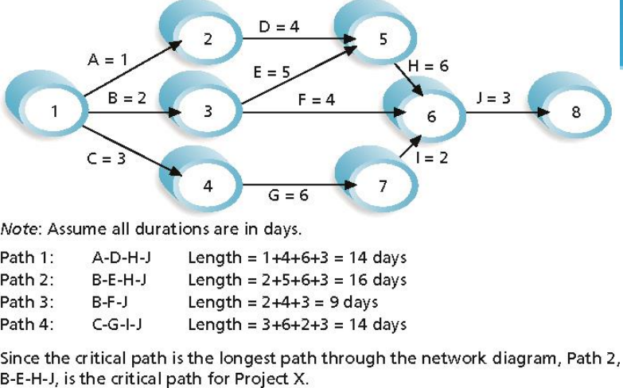

## Slack or float is the (#important)
amount of time an activity may be delayed without delaying a succeeding activity or the project finish date

Exemple si l'activité A et l'acti B sont des prérequis à l'acti C et que A est plus courte que B, le temps de flottement de A est égale à la différence de durée entre A et B

## Qu'est ce qu'un bufffer ? (#important)
temps additionel pour accomplir une tâche
- Murphy’s Law states that if something can go wrong, it
will.
- Parkinson’s Law states that work expands to fill the time allowed.
In traditional estimates, people often add a buffer to each
task and use it if it’s needed or not

## Quels sont les objectifs du nivellement/lissage des ressources ?(2)
- S’assurer que le niveau total des ressources requises à tout moment du projet ne dépasse pas le niveau maximal de disponibilité de ressources
- Minimiser les fluctuations dans le nombre de ressources utilisées

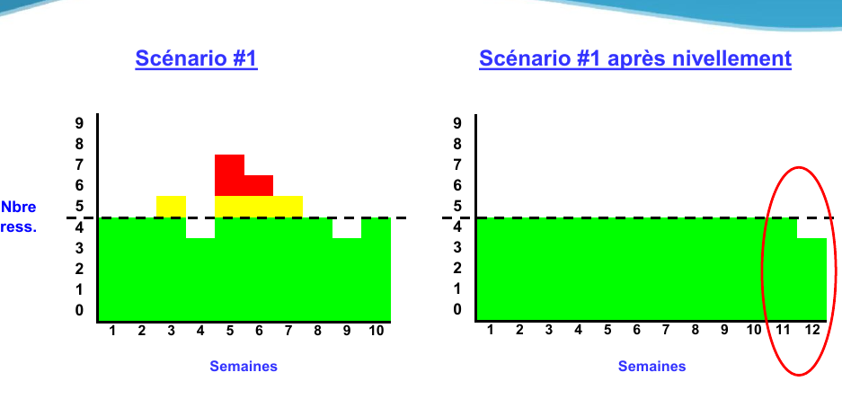
## Pour effectuer ce nivellement, on peut jouer sur : (3)
- Du flottement dans les activités non critiques
- De toute flexibilité dans les précédentes et dépendances établies
- De la latitude réelle sur les coûts, les spécifications et l’échéancier

## 2 technique de gestion de projet (#important)
- « Fast-Tracking » : maximiser la parallélisation
- « Crashing » : ajout de ressource

## Qu'implique le « Fast-Tracking » d’un projet ? (#important)
Réaliser en parallèle des tâches qui normalement devraient être réalisées séquentiellement.

 - Ex.: Je n’aurai jamais le temps de tondre ma pelouse d’ici 3 heures. Pour ce faire, j’applique le « fast-track » à ce projet
    - En demandant à ma blonde de faire le tour des arbres avec une 2 e tondeuse pendant que je passe le tracteur à pelouse.
    - Il y a un risque que notre travail ne soit pas parfait et que certains tours d’arbres soient à refaire.

## « Fast-Tracking » est surtout utilisée lorsque (2) (#important)
-  la variable « délai » est en danger ET que la variable « spécifications » est immuable ALORS QUE
- le chargé de projet a une certaine flexibilité au niveau du budget et des coûts.

## « Crashing » d’un projet implique essentiellement (#important)
d’ajouter des ressources.

  - Ex.: Je n’aurai jamais le temps de tondre ma pelouse d’ici 3 heures. Pour ce faire, j’applique le concept de « crashing » à ce projet
    - en achetant (ou en empruntant) une 3 e tondeuse et
    - en demandant de l’assistance ou embauchant un étudiant supplémentaire pour m’aider.

## « Crashing » est surtout utilisée (2):
- lorsque la variable « délai » est en danger ET que la variable « portée » est immuable ALORS QUE
- le chargé de projet a une certaine flexibilité au niveau des coûts.

> S10 (suite)
> Ordonnancement et Itérations
Objectifs
- Comprendre ce qu’est le risque et l’importance d’une bonne gestion du risque
- Aborder les éléments impliqués dans la gestion du risque et le contenu d’un plan de gestion du risque
- Identifier les risques les plus communs dans
les projets TI

## Pourquoi la gestion de risques ?
Car quand un problème se produit, on le règle et généralement le management nous félicite d’avoir passé à travers la tempête...

## Définitions du risque du dictionnaire (#important)
Danger éventuel plus ou moins prévisible.

## Définitions du risque selon SEI (Software Engineering Institute)(#important)
Le risque est la mesure de la probabilité et des conséquences de ne pas rencontrer les objectifs d’un projet !

## Risque vs facteur de risque (#important)
**Facteur de risque** : ne nuit directement au projet, augmente le nb et la proba des risques
**Risque** : nuit directement au projet

Ex :
- Équipe de développement est junior : **facteur de risque**, car ce n'est pas garantie qu'il nuit au projet.
- Le budget est serré : **risque**, car c'est un fait. Donc, c'est un risque.

## Risque à impact positif
événement éventuel qui peut survenir pourrait et avoir un conséquence positive

Ex : un jour ils ont construit une plateforme de forrage, un chantier de plusieurs milliard. Ils ont retardé la production et on produit quand le pétrole a eu une flambé de prix. Donc, le dépassement du temps (risque) a eu un impact positif.

## Composante d'un risque (3)
- Un événement (causant un changement indésirable)
- Une probabilité d’occurrence de cet événement
- L’impact (la conséquence) de cet événement

##  Le chargé de projet ne peut souvent intervenir que sur ces deux aspects du risque :
Probabilité et les impacts

> s11

## Formule de l'exposition :
$$ Exposition~=~Probabilité~\cdot~Impact $$

• Probabilité en % \\
• Impact en unité appropriée ($, efforts, parts de
marché, autre...)

## Type d'incertitude (#important)
- Connu/Connu (Known-Known)
- Connu/Inconnu (Known-Unknown)
- Inconnu/Inconnu (Unknown-unknown)

## Connu/Connu (#important)
Existence : **connu**
Va se produire ? : **connu** (vous le savez)
Impact : **connu**

Ce n’est donc pas un risque, c’est une **certitude**...

## Connu/Inconnu (#important)
Existence : **connu**
Va se produire ? : **inconnu** (vous ne le savez pas)
Impact : **inconnu**

C’est donc un **risque**.

## Inconnu/Inconnu (#important)
Existence : **inconnu**
Va se produire ? : **inconnu** (vous ne le savez pas)
Impact : **inconnu**

Vous n’avez aucune idée que le risque existe.

## Processus de gestion du risque (6) (#important)
- Planification de la gestion des risque
- Identification des risques
- Analyse qualitative des risques
- Analyse quantitative des risques
- Planification de la réponse aux risques
- Surveillance des risques

## Planification de la gestion des risques (5) (#important)
- Formalisation de comment sera géré les risques dans l’organisation
- Établissement des grilles de critères de sévérité et d’aide à l’identification des risques
- Définition des catégories de risque
- Définition du formulaire de description d’un risque
- Définition du registre des risques

## Catégorie de risques (3/10) (#important)
- Client
- Équipe de projet (RH)
- Produit
- Procédé
- Marché
- Technologie
- Ressources matérielles (RM)
- Ressources financières (RF)
- Contrat
- Envergure du projet

## Identification des risques (5) (#important)
- Identification des sources de risque
- Identification des événements potentiels pouvant causé des changements indésirables
- Identification des symptômes annonçant la matérialisation d’un risque
- Rédaction sous forme “Si..., Alors”
- Début de la rédaction du formulaire du risque

## Analyse des risques (5) (#important)
- Quantification des impacts (en $, en efforts, en parts de marché, en satisfaction client, autres...)
- Établissement de la sévérité selon les grilles des critères de sévérité
- Établissement de la probabilité selon la grille des probabilités
- Calcul de l’exposition
  - $$ Exposition = Probabilité \cdot Impact $$
- Poursuite de la rédaction du formulaire du risque

## Matrice d'évaluation des risques (#important)
$$ Exposition = Probabilité \cdot Impact $$
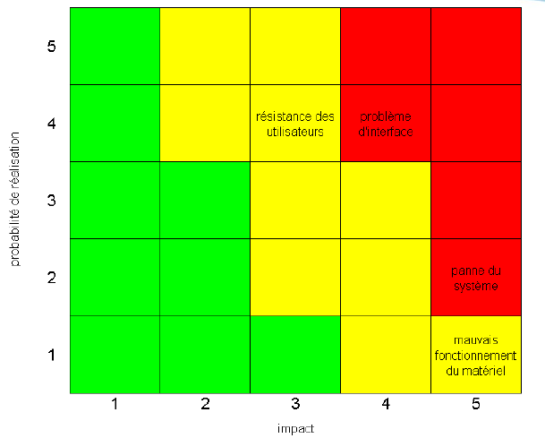

## Planification de la réponse aux risques (7) (#important)
- Établir le plan de gestion de ce risque
  - Choisir la stratégie de mitigation du risque
    - Acceptation
    - Évitement/élimination
    - Protection
    - Réduction proba/impact
    - Réserve (contingence)
    - Transfert
    - Recherche

## Stratégie de réponse : réduction du risque (2) (#important)
- Limiter la probabilité de réalisation du risque
- Minimiser l'impact du risque

## Stratégies de réponse : élimination du risque (2) (#important)
- Modifier le plan de projet
- Utiliser une technologie alternative

## Stratégies de réponse : transfert du risque (3) (#important)
- Contrat à forfait
- Garantie
- Assurance

## Stratégies de réponse : partage du risque (2) (#important)
- Partage des coûts
- Partage de la main-d’œuvre

## Stratégies de réponse : acceptation du risque (#important)
Choix délibéré et éclairé de l’équipe de projet d’accepter le risque se présentant à eux

## Surveillances des risques (5) (#important)
- Mise en application des stratégies de mitigation et de leurs approches
- Mise à jour des informations sur les risques par le cycle (identification, analyse et planification de la réponse au risque) en regard des risques déjà identifiés ou pour un nouveau risque
- Ajustements ou actions correctives en regard des risques
- Liste des Top 10 risques...facile et payant (80/20)
- Comité de suivi/Gestion des risques

## Techniques de quantification du risque (5)
- Calcul de l’exposition (pour établir la contingence : probabilité x impact)
- Sommes statistiques (Distribution triangulaire, distribution Bêta; calcul des valeurs pessimistes, optimistes et de la plus probable et l’écart type et la variance)
- Simulation (Monte Carlo --- Simulation de plusieurs déroulement de l’échéancier)
- Arbres de décision (explore des scénarios)
- Jugement d’experts

## Participant à la gestion du risque (6)
- Le gestionnaire de projet
- Les membres de l’équipe de projet
- Les ressources des disciplines impliquées dans le projet
- Les différentes fonctions de l’organisation (achats, ventes, finances, production, autres...)
- La direction
- Le client et son personnel

## Un système de base en gestion du risque (5)
- Le processus de gestion du risque (2 à 4 pages)
- La ou les grilles de critères de sévérité (1/3 de page par grille)
- La grille des probabilités
- La grille d’aide d’identification des risques (2 à 5 pages)
- Le formulaire de risque (1 à 3 page) ou Le registre des risques (1 page)

## Les 9 risques les plus importants en TI (3/9)
1. Besoins d’affaires mal définis, instables et croissants
2. Échéancier irréaliste
3. Mesure de performance inadéquate
4. Mauvaise gestion
5. Estimation erronée
6. Le syndrome de la balle d’argent («Silver Bullet»)
7. Faible qualité des livrables
8. Faible productivité de l’équipe
9. Projet annulé

## Qu'est ce qui est nécessaire pour la gestion de risque
Un système de base de gestion du risque

> S10 : La gestion des demandes de changement (DDC)

## Impacts sur un projet que peut avoir un changement (3/8)
- Le calendrier
- Les coûts
- La qualité
- Le contenu
- Les ressources humaines affectées au projet
- Les risques
- L’ordonnancement des activités
- Tous les documents de planification

## Le processus de gestion des DDC(demande de changement) couvre (5)
- Identification d’une demande de changement
- Autorisation d’évaluation d’une demande de changement
- Évaluation d’une demande de changement
- Décision de réalisation d’une demande de changement
- Réalisation d’une demande de changement

> s12

## A quoi sert le suivi et contrôle de projet ?
surveiller les processus associés au démarrage, à la planification, à l'exécution et à la clôture du projet.

## Le suivi comprends (4)
- la **collecte** des informations sur la performance
- la **mesure** des informations sur la performance
- la **diffusion** des informations sur la performance
- l'**évaluation** des mesures et des tendances afin d'améliorer les processus.

## Le suivi et contrôle de projet consiste à (7)
- comparer la performance réelle du projet au plan de gestion du projet
- évaluer la performance pour déterminer si des actions correctives ou préventives sont nécessaires, et recommander ces actions le cas échéant
- analyser, suivre et surveiller les risques du projet pour s'assurer que les risques sont identifiés, que leur état fait l'objet d'un rapport et que les plans appropriés des réponses aux risques sont exécutés
- maintenir une base d'informations précises et à jour sur le ou les produits du projet et la documentation afférente jusqu'à l'achèvement du projet
- fournir des informations à l'appui des rapports d'état, des mesures de progression et des prévisions
- fournir des prévisions pour mettre à jour l'information sur les coûts actuels et sur l'échéancier actuel
- surveiller la mise en oeuvre des modifications approuvées au fur et à mesure qu'elles ont lieu

## Activité du contrôle d'avancement (4) (less_imp)
1. Performance de la planification
2. Performance du travail effectué
   1. Le travail réel...
3. Comparé à la planification initiale...
   1. Implique des mesures de variance...
4. Prise d’action correctives si nécessaire

## Le Contrôle, c'est le pouvoir, autorité, hiérarchie ?
Non, c'est le monitoring d’un processus pour atteindre des objectifs.

## Principe du contrôle (3)
- Le **travail se contrôle,** pas les ressources
  -  Le contrôle permet aux ressources d’être plus efficaces et
en « maîtrise »
- Le contrôle est basé sur le **travail complété**
  -  Utiliser des livrables concrets et le travail réel effectué.
- **Balance**
  - Garder un niveau de contrôle approprié
  - Inclus: Micro gestion vs négligence...

## Objectifs - Revue de progrès (4)
- Obtenir une image juste de l’avancement du projet
- Rendre compte de l’avancement du projet au Client et à l ’Équipe
- Documenter et présenter les écarts rencontrés et les solutions envisagées
- Identifier les problématiques et prendre action

## Valeur acquise (Earned Value Management/Analyse de Variance) est
la mesure du progrès d’un projet.

## Quelles sont les valeurs utilsées dans l'analyse des variances
Pour **chaque** activité de l'échéancier ou lot de travail :
- Valeur planifiée (VP)
- Valeur acquise (VA)
- Coût réel (CR)

## Qu'est ce que la Valeur planifiée (VP)?
C'est le coût budgété du travail qu'il est prévu de réaliser pour une activité du WBS

## Qu'est ce que la Valeur acquise (VA)?
C'est le montant de travail budgété effectivement réalisé pour une activité du WBS

Montant planifié cumulé * % complété

## Qu'est ce que le coût réel (CR)?
C'est le coût total encouru pour effectuer le travail d'une activité du WBS. Cette valeur CR doit correspondre, par sa définition et ce qu'elle recouvre, à ce
qui a été budgété pour VP et VA (exemples : heures de main d'oeuvre directe uniquement, coûts directs uniquement, ou tous les coûts y compris les coûts indirects).

## Qu'est ce que l'écart de coût (EC)?
C'est la valeur acquise (VA) moins le coût réel (CR). À la fin du projet, l'écart de coût correspond à la différence
entre le budget à l'achèvement et le montant réellement dépensé.

- Formule : EC = VA – CR
  - EC > 0 : Travaux MOINS coûteux que prévu
  - EC = 0: coûts des travaux selon le plan
  - EC < 0 : travaux PLUS coûteux que prévu

## Qu'est ce que l'écart de délais (ED)?
C'est la valeur acquise (VA) moins la valeur planifiée (VP).
Lorsque le projet sera achevé, l'écart de délais sera finalement égal à zéro car toutes les valeurs prévues auront été acquises.
- Formule : ED = VA – VP
  - ED > 0 : Travaux en AVANCE
  - ED = 0 : Travaux selon le plan
  - ED < 0 : Travaux en RETARD

## Qu'est ce que l'IPC ?
C'est l'indicateur d'efficacité des coûts le plus couramment utilisé. Cet indice est égal au quotient Valeur acquise (VA) sur Coût réel
(CR).
- Formule : IPC = VA / CR
  - IPC > 1 : Travaux MOINS coûteux que prévu
  - IPC = 1 : Coûts des travaux selon le plan
  - IPC < 1 : Travaux PLUS coûteux que prévu

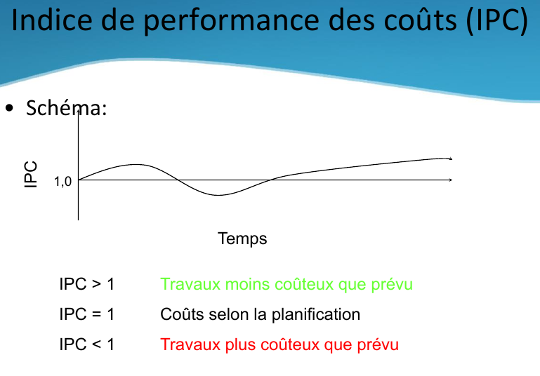

## Qu'est ce que l'IPE ?
C'est l'indicateur d'efficacité de l'échéancier le plus couramment utilisé. Cet indice est égal au quotient Valeur acquise (VA) sur Valeur Planifiée (VP).
- Formule : IPE = VA / VP
  - IPE > 1 : Travaux en AVANCE
  - IPE = 1 : Travaux selon le plan
  - IPE < 1 : Travaux en RETARD

## Pourquoi les besoin sont-ils si importants ?
Une modification des besoins peut coûter très cher en fonction de la phase d'avancement :
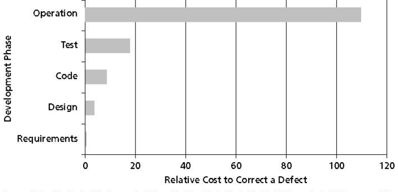

## Types de besoin fonctionnel (2)
- Fonctions
- Capacité

## (2) types de besoin Non fonctionnel
-  Utilisabilité : facteurs humains, aide, documentation
-  Capacité : disponibilité, relève, périodes de maintenance
-  Performance : temps réponse, performance machine, utilisation de ressources
-  Support : langues, ressources de support requises, etc...
-  Operations : gestion du système, installation, etc...
-  Intégration: intégration avec d’autres services et systèmes
-  Autres : matériel requis, aspects légaux, vente, etc...

## Le besoin doivent être (2)
- priorisés
- approuvés

## Techniques d’explicitation des exigences (6)(#important)
- Interviews et questionnaires
- Atelier d’explicitation d’exigences (Requirements Workshop)
- Session remue-méninges (Brainstorming)
- Scénario-maquette
- Jeux de rôles
- Prototypage

## Choix de la technique d’explicitation (7)
- Type de l’application
- Aptitude de l’équipe de développement
- Aptitude des clients
- L’envergure du problème
- La criticité (nature) du problème
- La terminologie
- Unicité de l’application

## Conseils pour réussir une interview (6)
- Préparation d’un contexte de libre interview
- Rechercher l’expérience des intéressés
- S’assurer que les questions posées sont cohérentes avec le gabarit
- Garder en tête l’objectif
- Reformuler les concepts
- À la fin, revoir les principaux éléments et s’assurer d’une compréhension commune

## Le questionnaire est limité, car (4)
- Difficile de trouver les bonnes questions à l’avance
- Les questions peuvent influencer les résultats
- Difficile d’explorer d’autres avenues
- Difficile de faire un suivi sur des réponses vagues

## Le questionnaire est utile pour
rejoindre un large auditoire avec des questions simples

## Pourquoi faire un atelier d’explicitation des exigences ? (5)
- Il aide à construire une équipe efficace, réunie pour un objectif commun : le succès du projet.
- Tous les intéressés (stakeholders) ont leur mot à dire, aucun n’est laissé de côté.
- Il se bâtit un accord entre les intéressés et l’équipe de
développement sur ce que l’application doit faire.
- Il peut exposer et résoudre les problèmes politiques qui peuvent compromettre le succès du projet.
- La définition préliminaire du système au niveau
caractéristique est immédiatement disponible suite à l’atelier.

## Remue-méninges (5)
- Elle encourage la participation de toutes les parties présentes.
- Elle encourage l’utilisation des idées des autres
- Le « facilitateur » prend note de tout ce qui se dit (rien n’est perdu)
- Elle résulte en un grand ensemble possible de solutions au problème posé
- Elle encourage toutes les idées sans contrainte

## Règles pour le remue-méninges (4)
- Pas de critiques ou débats
- Laisser place à l’imagination
- Générer autant d’idées que possible
- Combiner et muter les idées

## Étapes du remue-méninges (5)
- Génération d’idées
- Émondage (Pruning)(faire le tri)
- Regroupement
- Définition des caractéristiques
- Définition des priorités

## A quoi sert le Scénario-maquette ?
observer la réaction des utilisateurs tôt dans le cycle de vie du développement.

Avantages :
- Très faible coût
- Convivial, informel et interactif
- Permet une révision précoce des interfaces utilisateurs du système
- Facile à créer et à modifier

## Jeux de rôles
Les jeux de rôles permettent à l’équipe de développement d’expérimenter le monde des utilisateurs en jouant leurs rôles

## A quoi sert le prototypage ?
identifier les besoins réels des utilisateurs. Ils peuvent interagir de façon concrète avec une partie du système, ce qui permet de :
- Découvrir d’autres exigences, que les
utilisateurs n’ont pas su exprimer
- Éviter le syndrome «Oui, mais »

## Que faut-il prototyper ? (#important)
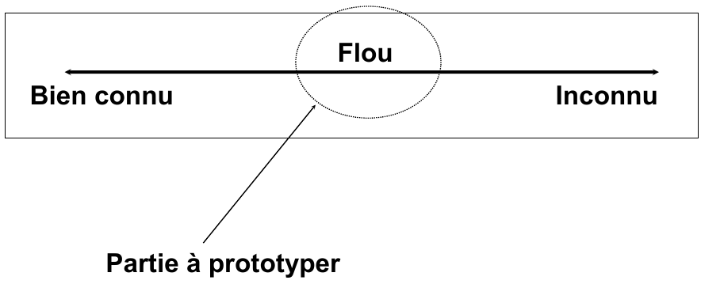

## Les dangers de prototypage (3)
- Le prototypage peut parfois glisser vers un prototypage fonctionnel...
- Les clients pensent alors qu’entre votre prototype et l’application finale il n’y a qu’un pas
- Ce n’est pas toujours vrai

## L'emphase du chargé de projet au quotidien devrait-elle être centrée sur : (3/10)
- Les tâches à accomplir ou sur les gens qui les font
- La vision d’ensemble et la synthèse ou la spécialisation/les méthodes
- L’équipe et l’esprit d’équipe ou la somme d’individus
- L’échange direct, l’écoute et le dialogue ou l’autorité et les ordres
- L’expertise des PERT / CPM ou les besoins réels à combler Le traitement des problèmes en temps réel ou en différé
- La négociation, le consensus et l’adhésion ou l’obéissance
- Un rôle du genre « supérieur-superviseur-contrôleur » ou un rôle de « pair et personne ressource » et le charisme
- Des relations verticales-hiérarchiques ou des relations horizontales-transversales
- La capacité de tolérer le flou, l’incertitude et le bruit et d’en minimiser les impacts sur l’équipe ou la capacité à les éliminer ou les réduire (quels que soient les moyens nécessaires)
- L’humilité pour pouvoir s’effacer devant l’équipe ou la visibilité, le crédit et la réputation de « l’expert »

## Rôle au quotidien (3/11)
- Les tâches à accomplir ou sur les gens qui les font
- La vision d’ensemble et la synthèse ou la spécialisation/les méthodes
- L’équipe et l’esprit d’équipe ou la somme d’individus
- L’échange direct, l’écoute et le dialogue ou l’autorité et les ordres
- L’expertise des PERT / CPM ou les besoins réels à combler
- Le traitement des problèmes en temps réel ou en différé
- La négociation, le consensus et l’adhésion ou l’obéissance
- Un rôle du genre « supérieur-superviseur-contrôleur » ou un rôle de « pair et personne ressource » et le charisme
- Des relations verticales-hiérarchiques ou des relations horizontales- transversales
- La capacité de tolérer le flou, l’incertitude et le bruit et d’en minimiser les impacts sur l’équipe ou la capacité à les éliminer ou les réduire (quels que soient les moyens nécessaires)
- L’humilité pour pouvoir s’effacer devant l’équipe ou la visibilité, le crédit et la réputation de « l’expert »

## Choisir un chargé de projet
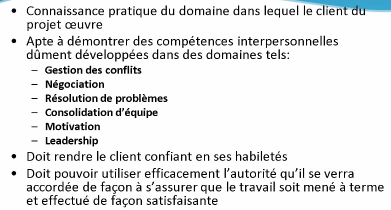

## Project Human Resource Management
- **Developing the human resource plan**: identifying and documenting project roles, responsibilities, and reporting relationships
-** Acquiring the project team**: getting the needed personnel
assigned to and working on the project
-** Developing the project team**: building individual and group skills to enhance project performance
- **Managing the project team**: tracking team member performance, motivating team members, providing timely feedback, resolving issues and conflicts, and coordinating changes to help enhance project performance

## Important areas related to project management include: (#important)
- Motivation theories
- Influence and power
- Effectiveness

## Type de motivation (#important)
- **Intrinsic motivation** causes people to participate in an activity for their own enjoyment
- **Extrinsic motivation** causes people to do something for a reward or to avoid a penalty

For example, some children take piano lessons
for intrinsic motivation (they enjoy it) while
others take them for extrinsic motivation (to get
a reward or avoid punishment)

## Maslow's Heriarchy of needs
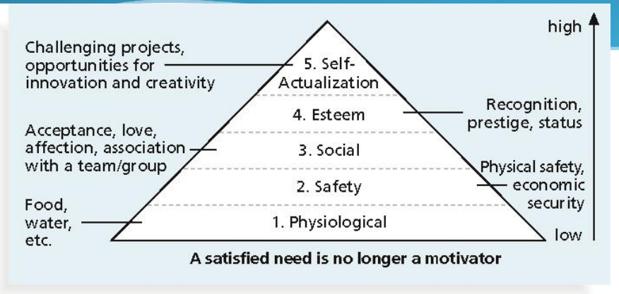

## Frederick Herzberg's motivational and hygiene factor (#important)
- **Motivational factors**: achievement, recognition, the work itself, responsibility, advancement, and growth, which produce job satisfaction
- **Hygiene factors**: cause dissatisfaction if notpresent, but do not motivate workers to do more; examples include larger salaries, more supervision, and a more attractive work
environment

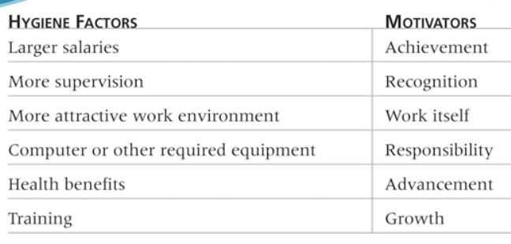

## McClelland's acquired-needs theory (#important)
Specific needs are acquired or learned over time and shaped by life experiences, including :

- **Achievement (nAch)**: achievers like challenging projects with achievable goals and lots of feedback
- **Affiliation (nAff)**: people with high nAff desire harmonious relationships and need to feel accepted by others, so managers should try to create a cooperative work environment for them
- **Power (nPow)**: people with a need for power desire either personal power (not good) or institutional power (good for the organization); provide institutional power seekers with management opportunities.

## Thamhain and Wilemon's ways to have influence on projects
- Authority: the legitimate hierarchical right to issue orders
- Assignment: the project manager's perceived ability to influence a worker's later work assignments
- Budget: the project manager's perceived ability to authorize others' use of discretionary funds
- Promotion: the ability to improve a worker's position
- Money: the ability to increase a worker's pay and benefits
- Penalty: the project manager's ability to cause
punishment
- Work challenge: the ability to assign work that
capitalizes on a worker's enjoyment of doing a particular
task
- Expertise: the project manager's perceived special
knowledge that others deem important
- Friendship: the ability to establish friendly personal
relationships between the project manager and others

##  Projects are more likely to succeed when project managers influence with:
- Expertise
- Work challenge

## Projects are more likely to fail whenproject managers rely too heavily on:
- Authority
- Money
- Penalty

## Power is the (#important)
potential ability to influence behavior to get people to do things they would not otherwise do

## Types of power include (5) (#important)
- Coercive
- Legitimate
- Expert
- Reward
- Referent

## Project managers can apply Covey’s 7 habits to improve effectiveness on projects (#important)
- Be proactive
- Begin with the end in mind
- Put first things first
- Think win/win
- Seek first to understand, then to be understood
- Synergize
- Sharpen the saw

## Tuckman Model of Team Development (5)
- Forming
- Storming
- Norming
- Performing
- Adjourning

## Social styles profile
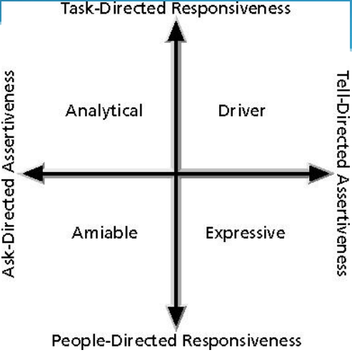

## The five dysfunctions of teams are:
- Absence of trust
- Fear of conflict : peur de s'exprimer,
- Lack of commitment
- Avoidance of accountability
- Inattention to results

## General advice on Teams (4)
- Plan some social activities to help project team members and other stakeholders get to know each other better
- Stress team identity
- Nurture team members and encourage them to help each other
- Take additional actions to work with virtual team members

## Project managers must (3)
- Treat people with consideration and respect
- Understand what motivates them
- Communicate carefully with them

## La gestion des communications du projet est le
domaine de connaissance qui emploie les processus nécessaires pour assurer, en temps voulu et de façon appropriée, la génération, la collecte, la diffusion, le stockage, la récupération et le traitement final des informations du projet.

## Le processus Établissement du rapport d'avancement implique
la collecte de toutes les données des références de base et la diffusion de l'information sur la performance aux parties prenantes.

## La gestion des parties prenantes fait référence au
management des communications pour satisfaire les besoins
des parties prenantes du projet et pour résoudre les
problèmes majeurs avec elles.

##  Un système de base pour gérer les communications comprend au moins :
- Un gabarit de compte-rendu de rencontre
- Un gabarit de revue de progrès
- Un registre des choses à faire (optionnel)
- Un registre des questions (optionnel)

## Les rencontres de statut (#important)
- Ce ne sont pas des sessions de travail pour résoudre les problèmes.
- Ce sont des rencontres d’information et de coordination.
- Seulement avec les personnes concernées

## Objectifs des rencontres de (5)
- Communiquer le statut des composantes clef du projet.
- Assurer que toutes les parties prenantes du projet comprennent le projet, sa performance, les problèmes, les options, les décisions, les risques.
- Obtenir l’assistance, l’approbation et le support des parties prenantes.
- Documenter les ententes et les décisions.
- Définir un plan d’action et de suivi.

## Une rencontre, c’est une opportunité de (3)
- Établir une ambiance, un environnement collaboratif
- Assurer un processus de prise de décision de qualité
- Partager votre optimisme

- Gérer la relation
- Faire la promotion des valeurs de l’entreprise
- Reconnaître les réalisations de l’équipe
- Créer un «mouvement vers l’avant»

## 3 types de rencontres de projet (#may_important)
- Le «Daily Team Stand-up»
- La rencontre de statut de l’équipe
-  Revue de projet «externe» (parties prenantes...)
- La communication «Flash»

## Le «daily Team Stand-up»  (#may_important)
- Au début de chaque journée (15 minutes):
- Rassemblez toute l’équipe
- Prenez le café et les viennoises
- Que chacun dise:
  - Ses accomplissements de la veille
  - Son plan de travail pour la journée
  - Ses contraintes («roadblocks»)
- Les membres qui le peuvent offrent leur assistance
- C’est le meilleur moment pour le PM pour mobiliser ses troupes et faire de la reconnaissance.

## La rencontre de statut de l’équipe (#important)
- À chaque semaine (30-45 minutes)
- Pour s’assurer que toute l’équipe est au diapason.
- Pour identifier les problèmes à résoudre.
- Pour assurer la cohésion de l’équipe.
- Pour partager de l’information «externe», des décisions des parties prenantes.
- Avant la rencontre:
  - Faites des rencontres individuelles pour connaître les enjeux clefs.
  - Préparez le rapport de variance.
    Pendant la rencontre, partager les informations sur:
  - La performance globale de l’équipe, les problèmes courants,
    l’échéancier et les coûts, les risques et les demandes de changement.
- Identifiez le focus pour la prochaine semaine.

## La revue de projet externe (#may_important)
- Aux deux ou trois semaines (20-30 minutes, des fois moins...)
- Avec le commanditaire, les clients, la direction.
- Pour informer du statut, décider des options de haut niveau et pour obtenir leur support
- Faites un rapport sur:
  - Les progrès, la performance et le statut des problèmes importants.
  - Expliquez les variances et les changement au plan de projet.
  - Expliquez les actions correctives que vous prenez.
  - Énoncez les risques pour la portée, le budget et l’échéancier.
- Discutez des changements de l’environnement du projet
- Faites le suivi de la rencontre précédente

## Communication flash (#may_important)s
- Il est critique de communiquer officiellement l’information aussitôt qu’elle est disponible.
- Tout délais pourrait être perçu comme un manque d’organisation de votre part ou de non confiance...
- Ne faites pas de surprise!
- Faites parvenir une courte note et si besoin, demandez une rencontre extraordinaire.

##  La fermeture de projet comprend
l'exécution de la partie du plan de management du projet consacrée à la clôture du projet.

## Fermeture administrative du projet détaille
toutes les activités, les interactions et les rôles et responsabilités correspondants des membres de l'équipe de projet
et des autres parties prenantes impliqués dans l'exécution de la procédure de clôture administrative du projet.

## Fermeture de contrat
définit en détail toutes les activités, les interactions et les
rôles et responsabilités correspondants, nécessaires pour régler et clore tout accord contractuel établi pour le projet, ainsi que pour définir les activités connexes qui soutiennent la clôture administrative formelle du projet.

> Redressement de projet

## Comment faire le redressement d’un projet en déroute...???
1. Diminuer la portée (Size of Software)
2. Augmenter la productivité
3. Changer l’échéancier (Schedule Slip)

## Étapes redressement de projet
- Évaluation de la situation
  - Date de livraison flexible ?, ce qui est négociable, etc.
- Demander des suggestions à votre équipe
- Stratégie de 2 livraisons...Step 1 Step 2...

- Les ressources
  - Gérer la motivation des employés
  - Procéder à la priorisation des tâches restantes
  - Participer à la solution de redressement
  - Maximiser le temps restant

- Erreurs classiques
  - Architecture déficiente, activités incomplètes, etc...
- “Miniature Milestones”
  - Petit en portée (jours), binaire, détaillée
  - Vous occuper de la motivation des ressources...
- Suivi méticuleux du progrès
- Revoir le reste à faire régulièrement
- Suivi des risques rigoureux

- Le produit...
  - Stabiliser les besoins (requirements)
  - Soyez le gardien des demandes de changement
  - Gestion de la portée – Fonctions à livrer
    - Priorité, coupure du non essentiel,...
  - “Take out the garbage”
    - Modules à problème, architecture déficiente,...
  - Obtenir un build stable et poursuivre le travail5 à partir de cette version de logiciel...

## Exam
Valeur indicateur de performance
- Savoir la significations des valeurs pour déterminer si un projet va bien
- Pour des calculs, on va avoir les formules
