# GLO-3101_midterm

- [GLO-3101_midterm](#glo-3101_midterm)
  - [(important) Gestion de projet est](#important-gestion-de-projet-est)
  - [(important) Principal objectif du PMBOK est de](#important-principal-objectif-du-pmbok-est-de)
  - [Bonne pratique signifie](#bonne-pratique-signifie)
  - [(important) Le PMBOK **n’est pas**](#important-le-pmbok-nest-pas)
  - [(important) Les 5 qualificatifs d'un projet](#important-les-5-qualificatifs-dun-projet)
  - [(important) Un projet est temporaire et donc définit par](#important-un-projet-est-temporaire-et-donc-définit-par)
  - [Le non-respect de la portée du projet impacte](#le-non-respect-de-la-portée-du-projet-impacte)
  - [(important) Types de projets (4)](#important-types-de-projets-4)
  - [Projets vs Opérations](#projets-vs-opérations)
  - [Projets opérationnel est](#projets-opérationnel-est)
  - [Raisons de faire de la GP/architecture logiciel (6)](#raisons-de-faire-de-la-gparchitecture-logiciel-6)
  - [Partie prenante est](#partie-prenante-est)
  - [(important) Gestion de projet est](#important-gestion-de-projet-est-1)
  - [(important) Principal objectif du PMBOK est de](#important-principal-objectif-du-pmbok-est-de-1)
  - [Bonne pratique signifie](#bonne-pratique-signifie-1)
  - [(important) Le PMBOK **n’est pas**](#important-le-pmbok-nest-pas-1)
  - [(important) Les 5 qualificatifs d'un projet](#important-les-5-qualificatifs-dun-projet-1)
  - [(important) Un projet est temporaire et donc définit par](#important-un-projet-est-temporaire-et-donc-définit-par-1)
  - [Le non-respect de la portée du projet impacte](#le-non-respect-de-la-portée-du-projet-impacte-1)
  - [(important) Types de projets (4)](#important-types-de-projets-4-1)
  - [Projets vs Opérations](#projets-vs-opérations-1)
  - [Projets opérationnel est](#projets-opérationnel-est-1)
  - [Raisons de faire de la GP/architecture logiciel (6)](#raisons-de-faire-de-la-gparchitecture-logiciel-6-1)
  - [Partie prenante est](#partie-prenante-est-1)
  - [3 milieux qui ont influencer la GP](#3-milieux-qui-ont-influencer-la-gp)
      - [S2](#s2)
  - [(important) Les 3P (+P) de la gestion de projet :](#important-les-3p-p-de-la-gestion-de-projet-)
  - [(important) People : facteurs de succès (5)](#important-people--facteurs-de-succès-5)
  - [(important) Process est (2)](#important-process-est-2)
  - [(important) 2 types de Process :](#important-2-types-de-process-)
  - [Product est](#product-est)
  - [2 dangers d'utilisation de la technologie](#2-dangers-dutilisation-de-la-technologie)
  - [4 règles d'or de la recette du succès :](#4-règles-dor-de-la-recette-du-succès-)
  - [4 tâches d'un gestionnaire de projet :](#4-tâches-dun-gestionnaire-de-projet-)
  - [(important) 10 facteurs de succès :](#important-10-facteurs-de-succès-)
  - [4 bonnes pratiques des gagnants](#4-bonnes-pratiques-des-gagnants)
  - [3 habileté des chargés de projets](#3-habileté-des-chargés-de-projets)
  - [Top 10 des habiletés du gestionnaire de projet](#top-10-des-habiletés-du-gestionnaire-de-projet)
  - [PMBOK détermine ce qui est approprié pour un projet spécifique?](#pmbok-détermine-ce-qui-est-approprié-pour-un-projet-spécifique)
    - [Waterfall](#waterfall)
    - [Limites du projet](#limites-du-projet)
  - [Interaction des groupes de processus](#interaction-des-groupes-de-processus)
  - [(important) Charte de projet définie](#important-charte-de-projet-définie)
  - [Différence critère vs facteur de succès](#différence-critère-vs-facteur-de-succès)
  - [Approche systémique est de](#approche-systémique-est-de)
  - [3 milieux qui ont influencer la GP](#3-milieux-qui-ont-influencer-la-gp-1)
  - [Modèle des 3 sphères](#modèle-des-3-sphères)
  - [Basework compliance c'est :](#basework-compliance-cest-)
  - [La gestion de projet est composé de :](#la-gestion-de-projet-est-composé-de-)
  - [La gestion de projet organise ... à l'intérieur de la ... :](#la-gestion-de-projet-organise--à-lintérieur-de-la--)
  - [La méthodologie change drastiquement en fonction du domaine ?](#la-méthodologie-change-drastiquement-en-fonction-du-domaine-)
  - [Cycle de vie (_Project Lifecycle_) c'est :](#cycle-de-vie-project-lifecycle-cest-)
  - [(important) Un livrable est :](#important-un-livrable-est-)
  - [Les livrables sont remis (au début / à la fin) de ... :](#les-livrables-sont-remis-au-début--à-la-fin-de--)
  - [Différents types Cycles et Phases :](#différents-types-cycles-et-phases-)
  - [5 processus clés selon le PMBOK  (important):](#5-processus-clés-selon-le-pmbok--important)
  - [Démarrage du PMBOK  (3) (important)](#démarrage-du-pmbok--3-important)
  - [Planification du PMBOK  (4) (important)](#planification-du-pmbok--4-important)
  - [Éxécution du PMBOK  (3) (important)](#éxécution-du-pmbok--3-important)
  - [Contrôle du PMBOK (3)  (important)](#contrôle-du-pmbok-3--important)
  - [Clôture du PMBOK  (3) (important)](#clôture-du-pmbok--3-important)
  - [Limites du projet :](#limites-du-projet-)
  - [*Systems Development Life Cycle (SDLC)* c'est :](#systems-development-life-cycle-sdlc-cest-)
  - [2 types de développement de logiciels :](#2-types-de-développement-de-logiciels-)
  - [Exemples de modéles de *Predictive life cycle* (6)](#exemples-de-modéles-de-predictive-life-cycle-6)
  - [Phases traditionnel du Project Life Cycle:](#phases-traditionnel-du-project-life-cycle)
  - [Une **porte (gate)** ou **kill point** c'est :](#une-porte-gate-ou-kill-point-cest-)
  - [Définition Génie Logiciel:](#définition-génie-logiciel)
  - [Schéma des 7 facettes du GLO et activités:](#schéma-des-7-facettes-du-glo-et-activités)
  - [(important) Le triangle des compromis:](#important-le-triangle-des-compromis)
  - [Quelles sont les relations dans le triangle de compromis ? (important)](#quelles-sont-les-relations-dans-le-triangle-de-compromis--important)
  - [Les critères du triangle **PRODUIT-COÛTS-ÉCHÉANCIER** sont tout le temps fixés au début du projet ?](#les-critères-du-triangle-produit-coûts-échéancier-sont-tout-le-temps-fixés-au-début-du-projet-)
  - [Triangle de l’Agilité :](#triangle-de-lagilité-)
  - [4 élements de l'organisation:](#4-élements-de-lorganisation)
  - [3 structures organisationnels:](#3-structures-organisationnels)
  - [Un silo dans une organisation c'est :](#un-silo-dans-une-organisation-cest-)
  - [Structure fonctionnelle, pros et cons :](#structure-fonctionnelle-pros-et-cons-)
  - [Organisation en mode projet, pros et cons :](#organisation-en-mode-projet-pros-et-cons-)
  - [Organisation matricielle, pros et cons :](#organisation-matricielle-pros-et-cons-)
  - [Influences de la structure organisationnelle sur les projets:](#influences-de-la-structure-organisationnelle-sur-les-projets)
    - [S5](#s5)
  - [Plan directeur des TI s’aligne](#plan-directeur-des-ti-saligne)
  - [Objectifs du plan directeur (4)](#objectifs-du-plan-directeur-4)
  - [Pourquoi un plan directeur? (3)](#pourquoi-un-plan-directeur-3)
  - [Les extrants du plan directeur (5)](#les-extrants-du-plan-directeur-5)
  - [Objectif du démarrage de projet est de](#objectif-du-démarrage-de-projet-est-de)
  - [Point du démarrage de projet (3)](#point-du-démarrage-de-projet-3)
  - [La charte de projet couvre (8)](#la-charte-de-projet-couvre-8)
  - [La charte de projet est évolue dans le temps. On dit qu'elle est](#la-charte-de-projet-est-évolue-dans-le-temps-on-dit-quelle-est)
  - [Un énoncé du contenu du projet comprend les éléments suivants (3/13) :](#un-énoncé-du-contenu-du-projet-comprend-les-éléments-suivants-313-)
  - [Le plan de management du projet définit la](#le-plan-de-management-du-projet-définit-la)
  - [Un plan de management du projet comprend les éléments suivants (8)](#un-plan-de-management-du-projet-comprend-les-éléments-suivants-8)
  - [La (ou les) rencontre de démarrage sert à](#la-ou-les-rencontre-de-démarrage-sert-à)
  - [Contenu de la rencontre de démarrage (3/13)](#contenu-de-la-rencontre-de-démarrage-313)
  - [La facilitation, c’est (1/4)](#la-facilitation-cest-14)
  - [Caractéristiques du facilitateur (2/7)](#caractéristiques-du-facilitateur-27)
  - [Le facilitateur contribue au succès de la rencontre en (3/14):](#le-facilitateur-contribue-au-succès-de-la-rencontre-en-314)
  - [Le manuel d’organisation de projet (MOP) précise](#le-manuel-dorganisation-de-projet-mop-précise)
  - [Objectif d'expliciter les requêtes des intervenants (3)](#objectif-dexpliciter-les-requêtes-des-intervenants-3)
  - [Étapes d'explicitation les requêtes des intervenants (4)](#étapes-dexplicitation-les-requêtes-des-intervenants-4)
  - [Le syndrome du oui... mais (important)](#le-syndrome-du-oui-mais-important)
  - [Le syndrome des ruines non découvert (important)](#le-syndrome-des-ruines-non-découvert-important)
  - [Les problèmes du syndrome des utilisateurs et des développeurs (4) (important)](#les-problèmes-du-syndrome-des-utilisateurs-et-des-développeurs-4-important)
  - [Les solutions du syndrome des utilisateurs et des développeurs (4) (important)](#les-solutions-du-syndrome-des-utilisateurs-et-des-développeurs-4-important)
  - [(2) types de besoin fonctionnel (important)](#2-types-de-besoin-fonctionnel-important)
  - [(2) types de besoin Non fonctionnel (important)](#2-types-de-besoin-non-fonctionnel-important)
  - [Bonnes pratiques gestion des besoins (3/6)](#bonnes-pratiques-gestion-des-besoins-36)
  - [Biens livrables de gestion (important)](#biens-livrables-de-gestion-important)
  - [Bien livrables de projet (important)](#bien-livrables-de-projet-important)
  - [Pourquoi s'assurer que le démarrage a bien couvert tout? (5)](#pourquoi-sassurer-que-le-démarrage-a-bien-couvert-tout-5)
  - [Planification consiste à l'](#planification-consiste-à-l)
  - [Estimation consiste à](#estimation-consiste-à)
  - [Ordonnancement consiste à](#ordonnancement-consiste-à)
  - [Capacité consiste à](#capacité-consiste-à)
  - [La planification en étapes (12)](#la-planification-en-étapes-12)
  - [Il faut décomposer les tâches pour](#il-faut-décomposer-les-tâches-pour)
  - [Causes d'échec et de dépassement de budget (3)](#causes-déchec-et-de-dépassement-de-budget-3)
  - [WBS est](#wbs-est)
  - [Un work package est](#un-work-package-est)
  - [Formats du WBS (2)](#formats-du-wbs-2)
  - [LE WBS ne présente pas](#le-wbs-ne-présente-pas)
  - [Type de WBS (2)](#type-de-wbs-2)
  - [Processus du PMP (5)](#processus-du-pmp-5)
  - [À quoi faire attention lors de la décomposition des tâches ?](#à-quoi-faire-attention-lors-de-la-décomposition-des-tâches-)
  - [Technique de WBS (5)](#technique-de-wbs-5)
  - [WBS : technique top-down](#wbs--technique-top-down)
  - [WBS : technique bottom-up](#wbs--technique-bottom-up)
  - [Relation durée-effort-unité](#relation-durée-effort-unité)
  - [Coût tangible](#coût-tangible)
  - [Coût intangible](#coût-intangible)
  - [Coût direct](#coût-direct)
  - [Coût indirect](#coût-indirect)
  - [Coût dépensé](#coût-dépensé)
  - [Plan de gestion de coût](#plan-de-gestion-de-coût)
  - [La contingence est](#la-contingence-est)
  - [La contingence n'est pas](#la-contingence-nest-pas)
  - [Types de contingence (2)](#types-de-contingence-2)
  - [Techniques d'estimation (3)](#techniques-destimation-3)
  - [Du général au particulier consiste](#du-général-au-particulier-consiste)
  - [Du particulier au général produit](#du-particulier-au-général-produit)
  - [Bonnes pratiques en estimations de coûts (5)](#bonnes-pratiques-en-estimations-de-coûts-5)
  - [Comment présenter les estimés ?](#comment-présenter-les-estimés-)
  - [Conséquence de estimés trop élevé (3)](#conséquence-de-estimés-trop-élevé-3)
  - [Conséquence de estimés trop basse (3)](#conséquence-de-estimés-trop-basse-3)
  - [Lecture (#important)](#lecture-important)
  - [(important)](#important)

## (important) Gestion de projet est
l'application des connaissances, des compétences, des outils et des techniques pour les activités du projet pour répondre aux exigences du projet.

## (important) Principal objectif du PMBOK est de
Définir le sous-ensemble du corpus de connaissances en management de projet qui est généralement reconnu de bonne pratique.

## Bonne pratique signifie
Qu’il est généralement admis que la mise en œuvre de ces compétences, outils et techniques peut améliorer les chances de succès de différents projets...

## (important) Le PMBOK **n’est pas**
Une méthodologie de gestion de projet, mais un corpus de connaissances sur le sujet.

## (important) Les 5 qualificatifs d'un projet
- Un processus unique de transformation de ressources
- Ayant pour but de réaliser d’une façon ponctuelle
- Produisant un extrant spécifique
- Répondant à un ou des objectifs précis
- À l’intérieur de contraintes budgétaires, matérielles, humaines et **temporelles**.

## (important) Un projet est temporaire et donc définit par
une **portée** et des ressources.

## Le non-respect de la portée du projet impacte
- Le temps
- Le budget
- Les ressources
- Les matériaux

## (important) Types de projets (4)
- Ouvrage : résultat unique
- Produit : mise au point d’une gamme de produit
- Opération : ex : fusion de deux entreprises, automatisation des processus, formation des personnels
- Evénement : ex : Coupe du monde de soccer, Jeux Olympique, finale de la LNH

## Projets vs Opérations
- Projets : **unique**, **temporaire**, **creation**, plus d'inovation, grande envergure
- Opération : **maintenance**, **récurrent**, **pas de livraison**, haut degré de standardisation, moins d'envergure

## Projets opérationnel est
Comme un projet, mais avec des tâches opérationnel récurrentes.

## Raisons de faire de la GP/architecture logiciel (6)
- Qualité
- Productivité
- Respect des coûts
- Diminution des risques
- Augmenter la probabilité de succès
- Cadrer le client (le client change d'idée)

## Partie prenante est
une personne qui fait partie du processus du projet.

## (important) Gestion de projet est
l'application des connaissances, des compétences, des outils et des techniques pour les activités du projet pour répondre aux exigences du projet.

## (important) Principal objectif du PMBOK est de
Définir le sous-ensemble du corpus de connaissances en management de projet qui est généralement reconnu de bonne pratique.

## Bonne pratique signifie
Qu’il est généralement admis que la mise en œuvre de ces compétences, outils et techniques peut **améliorer** les chances de succès de différents projets...

## (important) Le PMBOK **n’est pas**
Une méthodologie de gestion de projet, mais un corpus de connaissances sur le sujet.

## (important) Les 5 qualificatifs d'un projet
- Un processus unique de transformation de ressources
- Ayant pour but de réaliser d’une façon ponctuelle
- Produisant un extrant spécifique
- Répondant à un ou des objectifs précis
- À l’intérieur de contraintes budgétaires, matérielles, humaines et **temporelles**.

## (important) Un projet est temporaire et donc définit par
une **portée** et des ressources.

## Le non-respect de la portée du projet impacte
- Le temps
- Le budget
- Les ressources
- Les matériaux

## (important) Types de projets (4)
- Ouvrage : résultat unique
- Produit : mise au point d’une gamme de produit
- Opération : ex : fusion de deux entreprises, automatisation des processus, formation des personnels
- Evénement : ex : Coupe du monde de soccer, Jeux Olympique, finale de la LNH

## Projets vs Opérations
- Projets : **unique**, **temporaire**, **creation**, plus d'inovation, grande envergure
- Opération : **maintenance**, **récurrent**, **pas de livraison**, haut degré de standardisation, moins d'envergure

## Projets opérationnel est
Comme un projet, mais avec des tâches opérationnel récurrentes.

## Raisons de faire de la GP/architecture logiciel (6)
- Qualité
- Productivité
- Respect des coûts
- Diminution des risques
- Augmenter la probabilité de succès
- Cadrer le client (le client change d'idée)

## Partie prenante est
une personne qui fait partie du processus du projet.

## 3 milieux qui ont influencer la GP
Militaire, Défense et Construction

#### S2
## (important) Les 3P (+P) de la gestion de projet :
- People
- Process
- Product
- (Technologie)

## (important) People : facteurs de succès (5)
- Les bonnes tâches aux bonnes personnes
- Promouvoir le développement personnel
- Valorisation : individus vs équipe
- Communications claires
- La politique (en cas de conflits)

## (important) Process est (2)
- Les étapes pour réaliser le projet. (waterfall, agile, sprint)
- La base du développement informatique

## (important) 2 types de Process :
- Gestion
- Contenu (technique)

## Product est
ce que le projet produit : logiciel, la documentation, les services...

## 2 dangers d'utilisation de la technologie
- Plusieurs “religions”-Architectes (.net,
Java, etc...)
- Faire des “trip” techno dans les projets

## 4 règles d'or de la recette du succès :
- **Balancer** les 4 P tout au long du projet et dans chaque phase
- Promouvoir la **visibilité** du projet
- Utiliser judicieusement les concept de
« Software engineering » (**Méthodologie**)
- Utiliser judicieusement les **normes** et
**standards** reconnus

## 4 tâches d'un gestionnaire de projet :
- Planifie
- Organise
- Gère
- Présente l'information

## (important) 10 facteurs de succès :
1. Support de la direction : il fournit les ressources pour favoriser la réussite et il aide dans les moments difficiles.
2. Implication des usagers : connaissent les besoins, font des tests.

Moins important en dessous :
3. Chargé projet avec de l'expérience
4. Objectifs d’affaires précis
5. Portée précise (réduite...) : refactoring

Encore moins important :
6. Infrastructure logicielle “standard”
7. Besoins de base “fixes”
8. Méthodologie en place
9.  Estimés réalistes
10. Jalons définis, planification de projet, équipe compétence, and responsabilisation des participants (Ownership...)

## 4 bonnes pratiques des gagnants
- Approche intégré en gestion de projet avec une boîte à outils basée sur les principes du PMI...
- Forme leurs chargés de projets, avec une emphase sur les habiletés d’affaires et RH
- Utilise un processus de développement méthodologique
- Mesure la santé des projets avec des indicateurs de performance, sonde la satisfaction des clients et mesure le retour sur investissement

## 3 habileté des chargés de projets
- Être favorable et à l’aise avec le changement (Change management)
- Avoir une bonne connaissance de l’organisation
- Être capable de diriger une équipe dans l’accomplissement d’objectifs précis

## Top 10 des habiletés du gestionnaire de projet
1. Habileté en gestion de personnel (RH)
2. Leadership
3. Écoute
4. Intégrité, éthique, régulier...
5. Inspire la confiance
6. Communications verbales
7. Capacité de bâtir des équipes
8. Gestion de conflit
9. Esprit critique, capacité de résoudre des problèmes
10. Comprend et balance ses priorités...

## PMBOK détermine ce qui est approprié pour un projet spécifique?
Non, c'est l'équipe de management.

### Waterfall
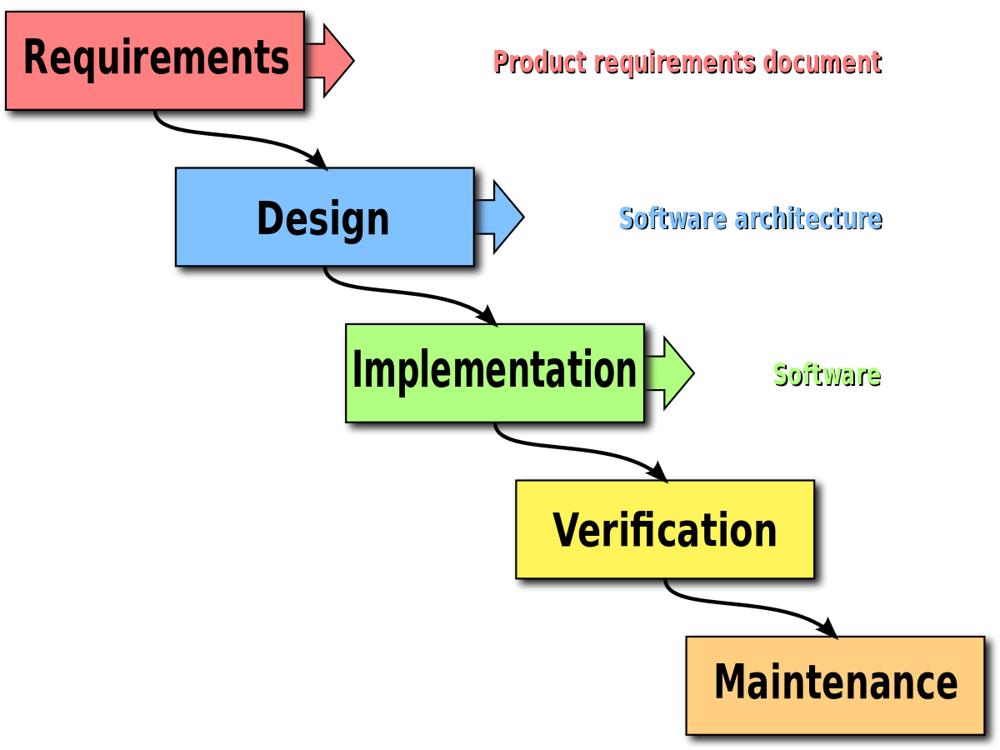

### Limites du projet
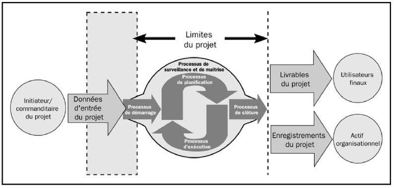

## Interaction des groupes de processus
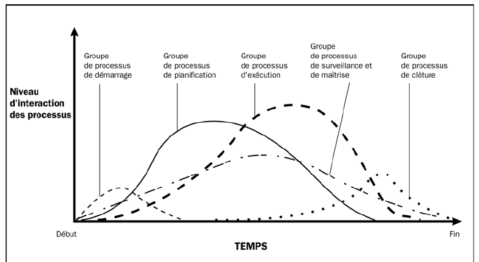

## (important) Charte de projet définie
the high-level boundaries of the project at minimum (The size of the project charter varies depending on the complexity of the project and the information known at the time of its creation).

## Différence critère vs facteur de succès
- Critère est requis pour la réussite.
- Facteur influe sur la réussite.

## Approche systémique est de
Comprendre le pourquoi du projet pour aider la prise de décision. (self)

## 3 milieux qui ont influencer la GP
Militaire, Défense et Construction

## Modèle des 3 sphères
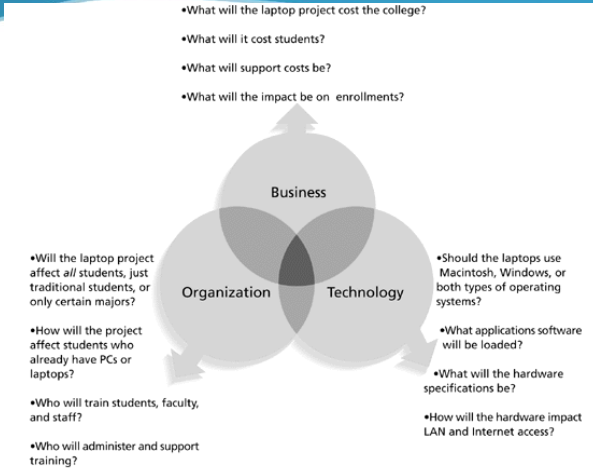
## Basework compliance c'est :
= agilité

## La gestion de projet est composé de :
Processus

## La gestion de projet organise ... à l'intérieur de la ... :
- _les processus_
- _méthodologie_

## La méthodologie change drastiquement en fonction du domaine ?
Oui

## Cycle de vie (_Project Lifecycle_) c'est :
toutes les phases d'un projet

## (important) Un livrable est :
un produit ou un sevice réalisé dans le cadre du projet (exemple: chartre de projet, backlog, code sources, artefacts, ...)

## Les livrables sont remis (au début / à la fin) de ... :
- à la fin
- CHAQUE phase du projet

## Différents types Cycles et Phases :
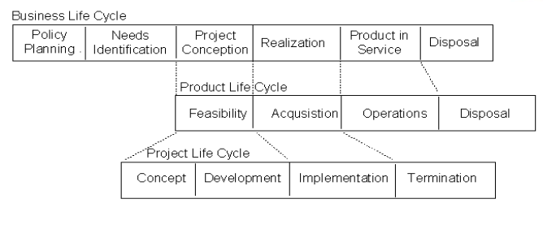

## 5 processus clés selon le PMBOK  (important):
1. **Démarrage**
2. **Plannification**
3. **Exécution**
4. **Contrôle**
5. **Clôture**

## Démarrage du PMBOK  (3) (important)
  - **Définir** le projet,
  - Vérifier la **faisabilité du projet**,
  - Définir clairement le mandat.

 ## Planification du PMBOK  (4) (important)
  -  **Affiner** les objectifs,
  -  Identifier les **actions requises**,
  -  Évaluer les **efforts**, **durées** et **coûts**,
  -  **Planifier** le déroulement à l'intérieur **des contraintes**.

## Éxécution du PMBOK  (3) (important)
  - **Intégrer** les ressources retenues,
  - Suivre des **actions** et des **intéractions**,
  - Respecter l'**envergure du projet**.

## Contrôle du PMBOK (3)  (important)
  - **Mesurer** régulièrement **les efforts**, **les coûts** et **la progression**,
  - Identifier **les écarts** par rapport au **plan de projet**,
  - Identifier et appliquer **à temps** les **actions correctives** nécessaires.

## Clôture du PMBOK  (3) (important)
  - **Formaliser l'acceptation** des biens livrables,
  - **Conclure** le projet ou la phase,
  - Tirer **les leçons**.

## Limites du projet :
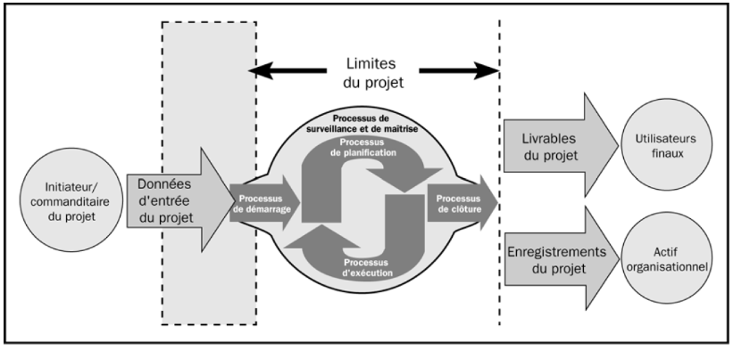

## *Systems Development Life Cycle (SDLC)* c'est :
les phases incluses dans le développement et le maintient de produits informatique.

## 2 types de développement de logiciels :
- **Predictive life cycle**: portée **claire**, l’échéancier et les coûts **prévisibles**.
- **Adaptive Software Development (ASD) life cycle**: développement **flexible** pour répondre à des **besoins flous** ou **changeants**. Ex : Agile

## Exemples de modéles de *Predictive life cycle* (6)
- waterfall
- spiral
- incremental
- prototyping
- Rapid Application Development (RAD)

## Phases traditionnel du Project Life Cycle:
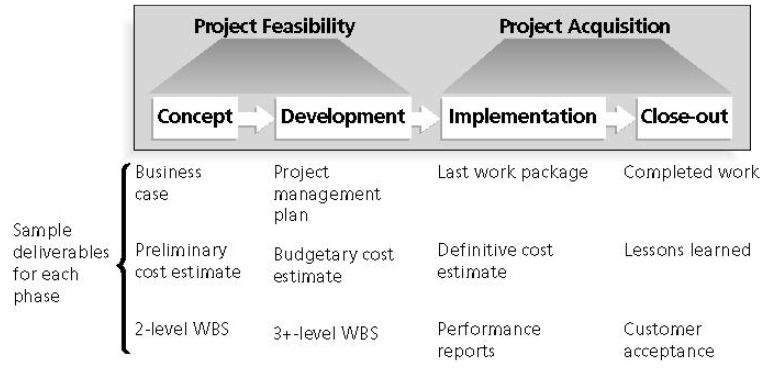

## Une **porte (gate)** ou **kill point** c'est :
des critères de passage d’une phase à l’autre

## Définition Génie Logiciel:
« Software engineering is a **systematic** and **disciplined** approach to developing software. It applies both computer science and engineering principles and practices to the **creation**, **operation**, and **maintenance** of software systems. »

## Schéma des 7 facettes du GLO et activités:
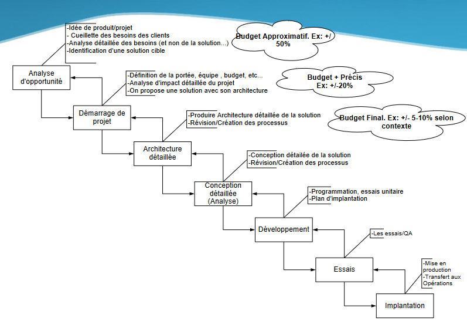
*VOIR BUDGET IMPORTANT*

## (important) Le triangle des compromis:
- **PRIX-COÛT-ÉCHÉANCIER**
- 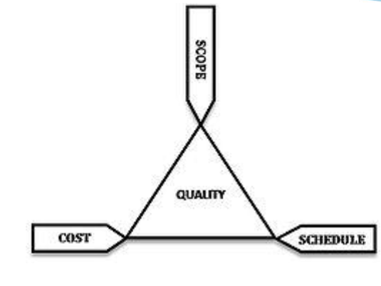

## Quelles sont les relations dans le triangle de compromis ? (important)
Par exemple, rapprocher la date implique réduire la portée ou augmenter les coûts.

## Les critères du triangle **PRODUIT-COÛTS-ÉCHÉANCIER** sont tout le temps fixés au début du projet ?
Non : certains peuvent être flexible lors d'un projet.

## Triangle de l’Agilité :
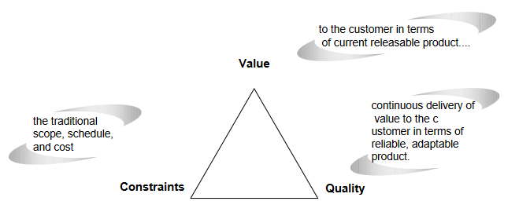

## 4 élements de l'organisation:
- **Cadre structurel** : définition des **rôles** et **responsabilités** (hiérarchie par exemple),
- **Cadre RH** : garantit **l'harmonie** entre les **besoins** de l'organisation et des collaborateurs
- **Cadre politique** : comprendre les relations entre les collaborateurs. Les jeux de pouvoir et les conflits sont les problèmes les plus fréquents.
- **Cadre symbolique** : culture au sein de l'organisation. Se méfier des possible interprétations des actions.

## 3 structures organisationnels:
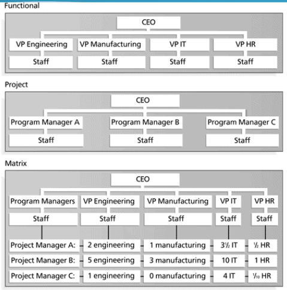

## Un silo dans une organisation c'est :
l'image de l'isolation de l'information par secteur.

## Structure fonctionnelle, pros et cons :
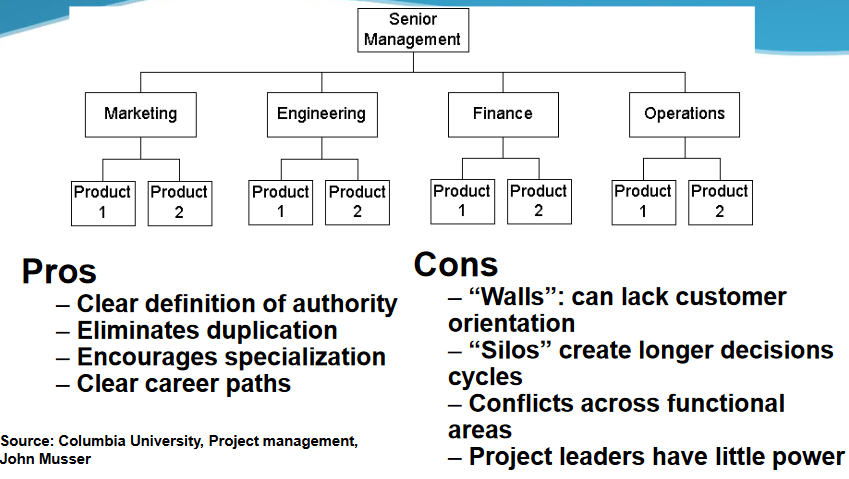

## Organisation en mode projet, pros et cons :
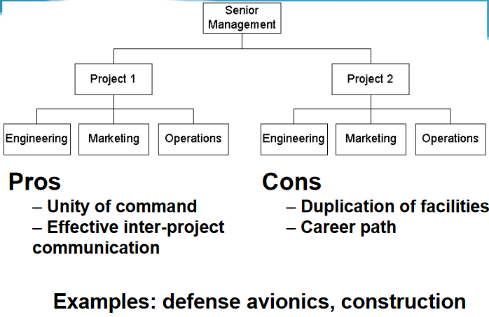

## Organisation matricielle, pros et cons :
- 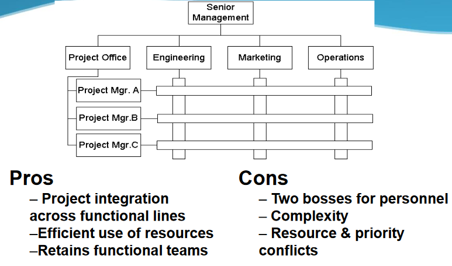
- **Bureau de projet important**

## Influences de la structure organisationnelle sur les projets:
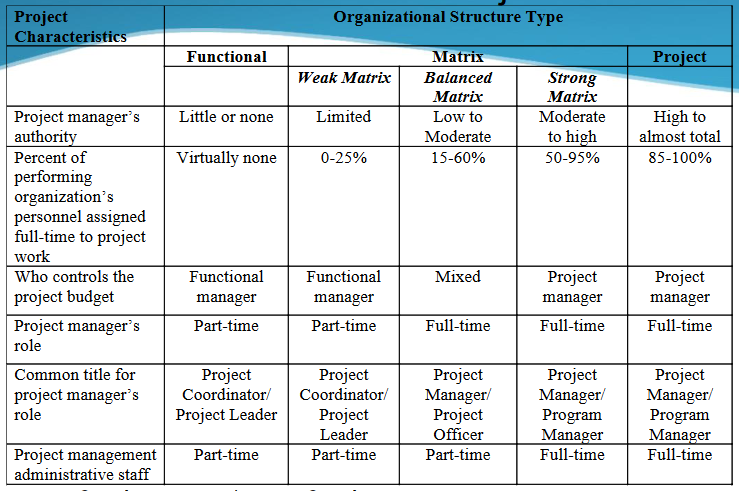

### S5

## Plan directeur des TI s’aligne
avec la mission de l’organisation et documente ce qui doit être réalisé au cours des 3-5 prochaines années en TI (où suis-je?, où est-ce que je veux m'en aller?).
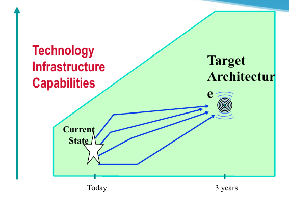

## Objectifs du plan directeur (4)
- Identifier les projets de développement et d’implantation de systèmes, qui vont supporter l’entreprise
- Identifier les TI requises
- Construire un premier modèle des systèmes d’information
- Définir l’organisation à mettre en place

## Pourquoi un plan directeur? (3)
- Pour mettre l’informatique au service de l’entreprise
- Pour profiter de toutes les opportunités apportées par les TI
- Pour gérer au mieux les ressources informatiques

## Les extrants du plan directeur (5)
- Un modèle des SI de l’entreprise
- Un portefeuille de projets rangés par priorité
- Des orientations technologiques
- Une enveloppe budgétaire
- Un mode de gestion (2 aspects)

## Objectif du démarrage de projet est de
planifier en détail le projet pour obtenir une approbation du client pour le GO/NO GO.

## Point du démarrage de projet (3)
- Activités: Analyse d’impact (liste des travaux), Planification détaillée.
- Livrable: charte/manuel de projet, planification détaillée, plan des ressources, budget plus précis, plan d’acquisition (au besoin)
- Extrant: Le client approuve/rejette le projet-investissement

> s6

## La charte de projet couvre (8)
- Définition du projet (brève)
- Objectifs ou justification du projet
- Inclus dans la portée
- Exclus de la portée
- Les parties prenantes
- Hypothèses et contraintes
- Budget
- Échéancier

## La charte de projet est évolue dans le temps. On dit qu'elle est
vivante

## Un énoncé du contenu du projet comprend les éléments suivants (3/13) :
- Définition du projet (détaillée)
- Portée du projet
- Objectifs du projet
- Contexte du projet
- Les hypothèses
- Les contraintes
- Les principaux risques
- Les facteurs de succès
- Budget et coûts
- Modalité de facturation/imputation
- Critères de satisfaction ou d’acceptation
- L’échéancier
- Les biens livrables

## Le plan de management du projet définit la
manière dont le projet est exécuté, surveillé et
maîtrisé, et clos.

## Un plan de management du projet comprend les éléments suivants (8)
Plan de gestion du contenu
                de l’échéancier
                des coûts
                de la qualité
                des ressources humaines
                des communications
                des risques
                des approvisionnements

## La (ou les) rencontre de démarrage sert à
informer toutes les parties prenantes sur le projet en début de projet, de manière à aligner tous et chacun dans la même direction.

## Contenu de la rencontre de démarrage (3/13)
- Définition du projet
- Portée du projet (inclus et exclus)
- Objectifs du projet
- Contexte du projet
- Les parties prenantes
- Les principaux risques
- Les facteurs de succès
- Budget et coûts
- Critères de satisfaction ou d’acceptation
- L’échéancier
- Les biens livrables
- Les modalités de gestion
- Qui fait quoi

## La facilitation, c’est (1/4)
l’art d’avoir du leadership sans prendre le contrôle.

- Sans être un joueur, agir en tant qu’arbitre.
- Observer l’action au lieu d’en faire partie.
- Diriger/décider des activités du groupe, mais ne prends pas de décisions.
- Écouter des émotions du groupe et assure le bon déroulement des discussions.

## Caractéristiques du facilitateur (2/7)
- Neutre en tout temps
- Procure une structure de discussions qui aide
le groupe à prendre des décisions efficaces.

Moins important :
- Il se concentre sur l’atteinte des objectifs.
- Aide à avoir les bonnes personnes.
- Aide à bâtir l’identité du groupe.
- S’assure que tous participent.
- Assure la saine gestion des conflits.
- Il est flexible.
- Stimule la créativité.

## Le facilitateur contribue au succès de la rencontre en (3/14):
- Aidant le groupe à définir ses objectifs.
- Aidant les membres à comprendre leurs besoins et à créer un plan de match pour les satisfaire.
- Proposant un processus qui aidera les membres à être efficaces et à prendre des décisions de qualité.
- Guidant les discussions.
- Assurant qu’il y ait consensus dans les décision du groupe et qu’elles tiennent compte des idées de chaque participant.
- S’assurant que les notes de la rencontre reflètent les idées du groupe.
- Supportant les membres à gérer leur propre
dynamique interpersonnelle.
- Donnant de la rétroaction au groupe pour qu’il comprennent leurs progrès et qu’il fassent les ajustements requis.
- Utilisant une approche collaborative pour gérer les conflits.
- Aidant le groupe à communiquer efficacement.

Vous devez croire que :
- Les personnes sont intelligentes, capables et qu’elles veulent faire la bonne chose.
- Les groupes peuvent prendre de meilleures décisions
que les personnes seules.
- L’opinion de tous a la même valeur. Peu importe leur
rang hiérarchique.
- Les gens s’engagent d’avantage pour des idées et
des plans qu’ils ont participé à créer.

## Le manuel d’organisation de projet (MOP) précise
la **portée** et le **cadre** de gestion du projet.

## Objectif d'expliciter les requêtes des intervenants (3)
- Déterminer qui sont les intervenants du projet.
- Déterminer quels sont les besoins.
- Prioriser les requêtes des intervenants.

## Étapes d'explicitation les requêtes des intervenants (4)
1. Identifier les sources d’information des
exigences
2. Récupérer l’information
3. Réaliser des ateliers d’explicitation des
exigences
4. Évaluer les résultats

## Le syndrome du oui... mais (important)
Lorsque l’utilisateur voit l’implémentation, il y a 2 réactions possibles
- Wow, c’est cool
- Oui, mais... maintenant que je vois ça, pourrions-nous...

Solution :
- Permet de découvrir de nouvelles exigences
- Minimiser ce syndrome en explicitant les exigences plus tôt

## Le syndrome des ruines non découvert (important)
- Plus vous en trouvez... moins il y en a, mais vous ne saurez jamais si vous les avez tous trouvées.
- Même chose pour les exigences.

## Les problèmes du syndrome des utilisateurs et des développeurs (4) (important)
- L’utilisateur ne sait pas ce qu’il veut. Il le sait, mais ne peut l’expliquer
- L’utilisateur pense savoir ce qu’il veut – avant de se le faire dire par le développeur
- L’analyste pense savoir + que l’utilisateur
- Tout le monde pense que tous les autres font de la politique

## Les solutions du syndrome des utilisateurs et des développeurs (4) (important)
- Reconnaître et apprécier l’utilisateur comme un expert du domaine.
- Essayer différentes techniques d’explicitation des exigences
- Mettez-vous à la place de l’utilisateur, faites son travail pendant 1 heure ou 2.
- La politique fait partie de la nature humaine...

## (2) types de besoin fonctionnel (important)
- Fonctions
- Capacité

## (2) types de besoin Non fonctionnel (important)
-  Utilisabilité : facteurs humains, aide, documentation
-  Capacité : disponibilité, relève, périodes de maintenance
-  Performance : temps réponse, performance machine, utilisation de ressources
-  Support : langues, ressources de support requises, etc...
-  Operations : gestion du système, installation, etc...
-  Intégration: intégration avec d’autres services et systèmes
-  Autres : matériel requis, aspects légaux, vente, etc...

## Bonnes pratiques gestion des besoins (3/6)
- Avoir une méthode de gestion des besoins pour bien distinguer les besoins des solutions
- Travailler conjointement avec les utilisateurs dans ce processus
- Utilisation de techniques reconnues (Maquettes, Use Case Modeling, Joint App Development - JAD)
- S’assurer que les besoins sont documentés
- Bien planifier les essais et l’arrimage aux besoins
- Utiliser les critères SMART pour les besoins, les critères de succès et les contraintes

## Biens livrables de gestion (important)
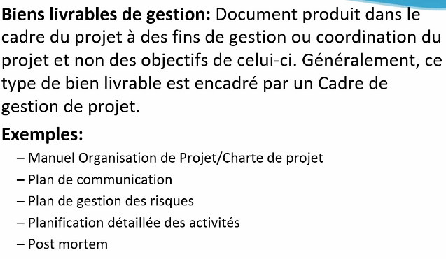

## Bien livrables de projet (important)
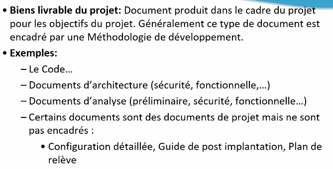

## Pourquoi s'assurer que le démarrage a bien couvert tout? (5)
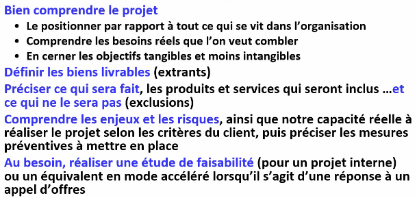

## Planification consiste à l'

## Estimation consiste à

## Ordonnancement consiste à

## Capacité consiste à

## La planification en étapes (12)
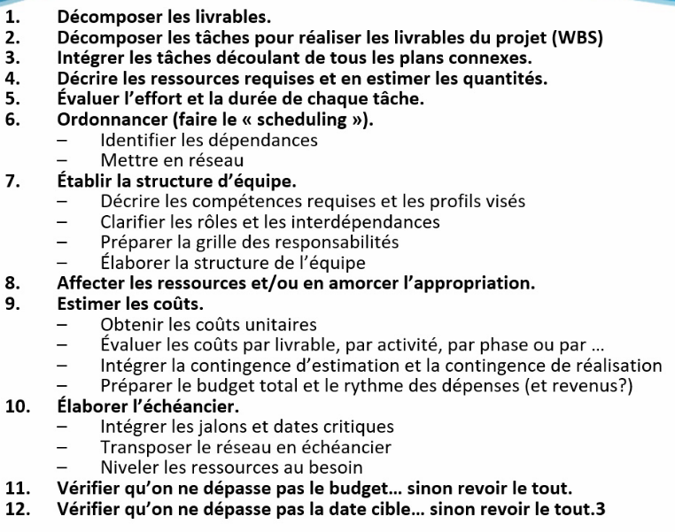

## Il faut décomposer les tâches pour
être capable d'estimer les efforts.

## Causes d'échec et de dépassement de budget (3)
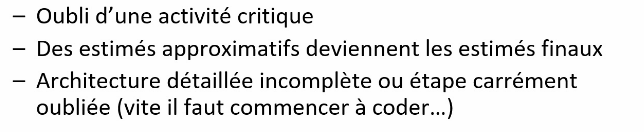

## WBS est
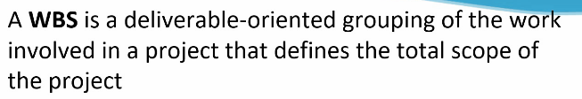

## Un work package est

## Formats du WBS (2)

## LE WBS ne présente pas
les dépendances ou les durées.

## Type de WBS (2)
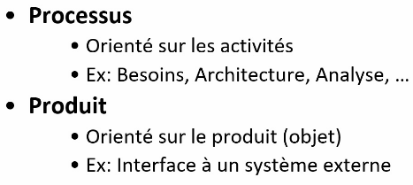
Exemple :
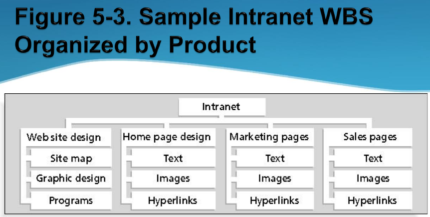
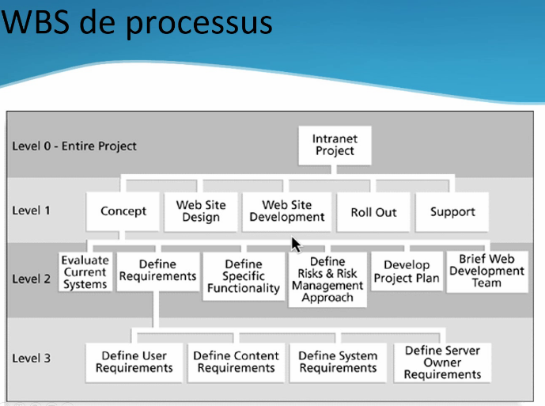
## Processus du PMP (5)
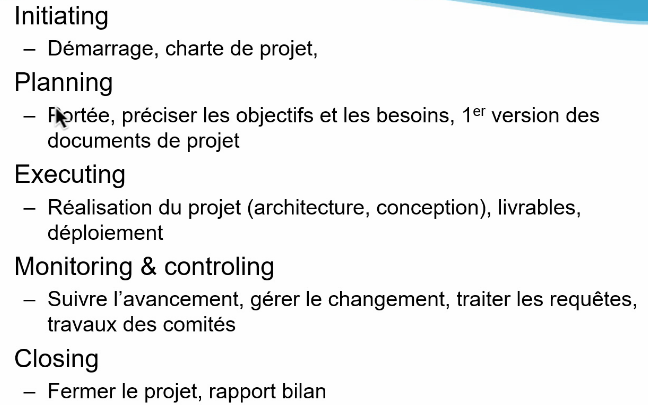

## À quoi faire attention lors de la décomposition des tâches ?

## Technique de WBS (5)
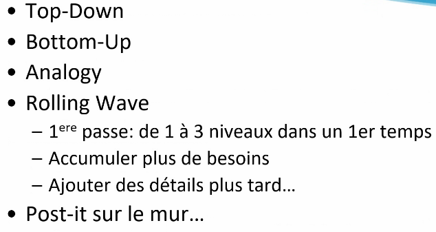

## WBS : technique top-down
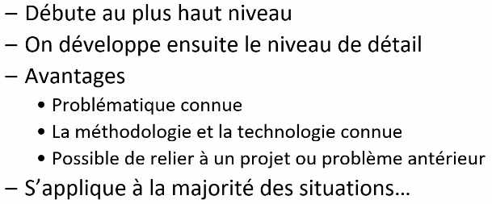

## WBS : technique bottom-up
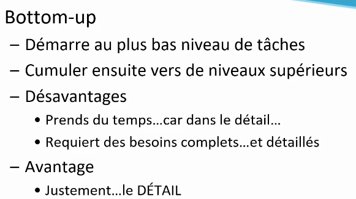

## Relation durée-effort-unité
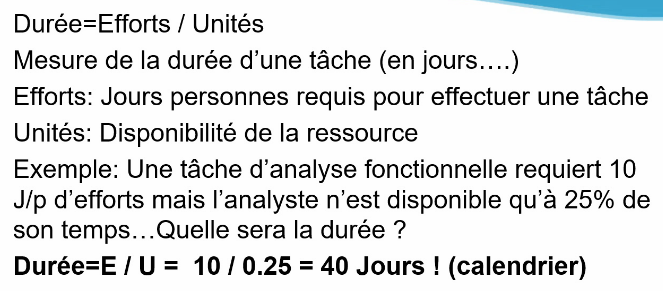

## Coût tangible
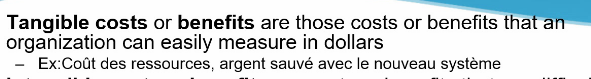

## Coût intangible
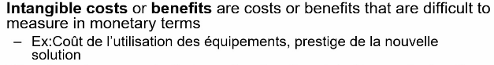

## Coût direct

## Coût indirect
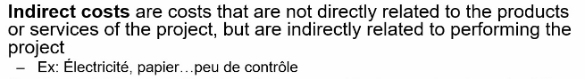

## Coût dépensé
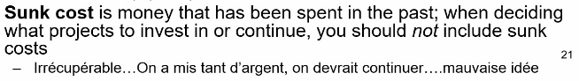

## Plan de gestion de coût

## La contingence est

## La contingence n'est pas
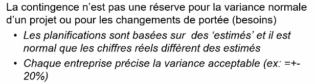

## Types de contingence (2)
- Gestion
- Risques

## Techniques d'estimation (3)
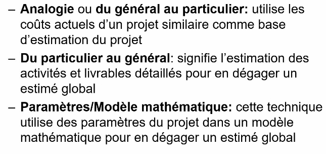

## Du général au particulier consiste
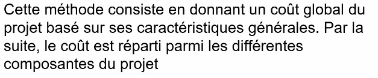

## Du particulier au général produit

## Bonnes pratiques en estimations de coûts (5)
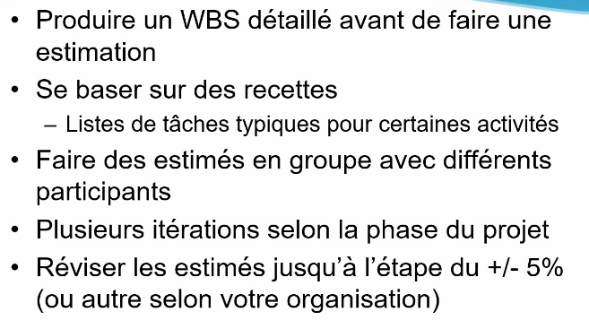

## Comment présenter les estimés ?
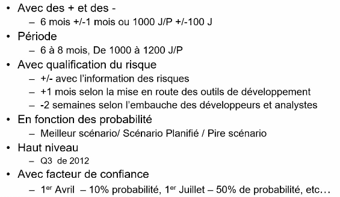

## Conséquence de estimés trop élevé (3)
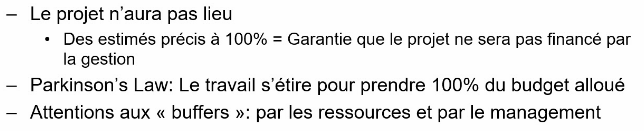

## Conséquence de estimés trop basse (3)
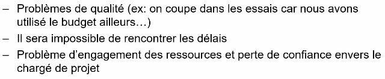

## Lecture (#important)

- WBS...

Explicitation des exigences
- Combien de temps faut-il consacrer à l'explicitation des exigences
  - La complexité, la grandeur et l'importance du projet le détermine.
- Coûts d’une exigences si détecté...
  - 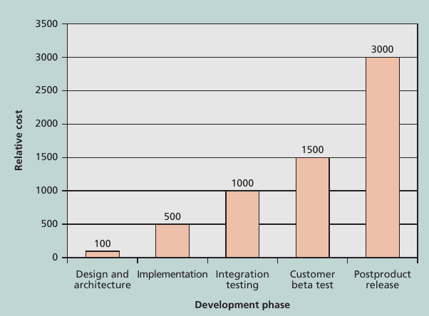
- Comment les exigences sont récoltés?
  - Interview des parties prenantes en one on one
  - Focus group using group creativity
  - Questionnaires/surveys
  - Observations
  - Prototyping
  - Comparaison avec d'autres projets -->

## (important)
Charte de projet à l'examen
